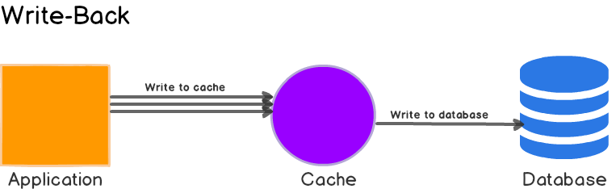
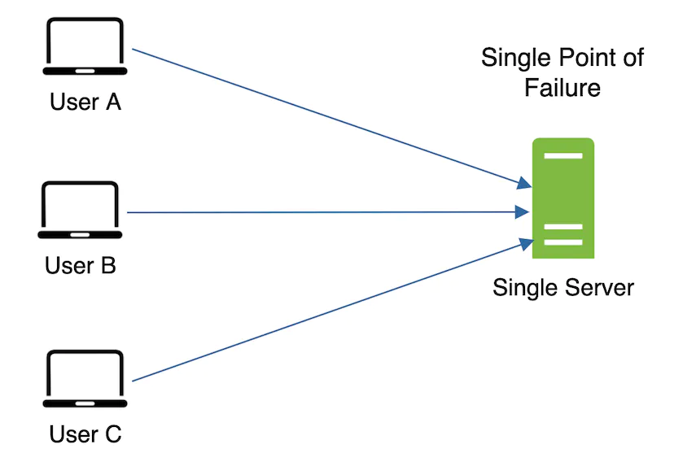

### Cache Tier

- Web server <-> Cache <-> DB
- Benefits:
  - Better system performance
  - Ability to scale the cache tier independently.
- Data access patterns(how data is written and read):
  - write heavy and reads less frequently? (e.g. time based logs)
  - written once and read multiple times? (e.g. user profile)
  - data returned is always unique? (search queries)
- Different Caching Strategies:
  1. Cache-Aside
  2. Read-Through Cache
  3. Write-Through Cache
  4. Write-Around
  5. Write-Back or Write-Behind

1. Cache-Aside:

- No connection btw cache and db.
- The application first checks the cache
- if data is found in cache, return it to the client
- if not in cache, the application queries db, returns it to the client and stores the data in cache.
- **read-heavy** workloads.
- Memcached and Redis are widely used.
- load data **lazily**

(+) Resilient to cache failures.
(+) Data model in cache and in db can be different. e.g. the response generated as a result of multiple queries can be stored against some request id.
(-) if the cache cluster goes down during peak load, response times can become terrible and in worst case, the db can stop working.
(-) the most common write strategy is to write data to the db directly. That means inconsistency btw cache and db. To prevent this:

- TTL (time to live) is generally used and continue serving stale data until TTL expires.
- If data freshness must be guaranteed, either invalidate the cache entry or use an appropriate write strategy.

2. Read-Through Cache:

- Cache sits in-line with the db: application <-> cache <-> db.
- load data **lazily**
- work best for **read-heavy** workloads e.g. a news story.

(-) When data is requested for the first time, it always result in cache miss and incurs the extra penalty of loading data to the cache. This is dealed with "warming" or "pre-heating" the cache by issuing queries manually.
(-) Inconsistency btw db and cache, solution can be writing strategy.

**Cache-Aside vs *Read-Through:**

- the application is responsible for fetching data from db and populating cache VS this logic is usually supported by the library or stand-alone cache provider.
- the data model in cache and in db can be different VS cannot be different.

3. Write-Through Cache:

- The application writes the data directly to the cache
- The cache updates the data in the main db.
(+) Consistency with the main db.
(+) When paired with read-through caches, better use cases.
(-) Extra write latency (2 write operations: cache, db)
- DynamoDB Accelator (DAX), example of read-through/write-through cache. Application <-> DynamoDB Accelator <-> DynamoDB

4. Write-Around:

- Data is written directly to the db, only the data is read updated in cache.
- Paired with Read-Through: good performance when e.g. written once and read less frequently or never. e.g. real-time logs or chatroom messages.
- Can be paired with cache-aside as well.

5. Write-Back or Write-Behind:

- The Application writes data to the cache
- Cache acknowledges to the application *immediately*.
- Later, the cache writes the data back to the db.
- Very similar to Write-Through. Unlike Write-Through this is done *async*.
- Good for **write-heavy** workloads.
- Paired with read-through, works good for mixed workloads (the most recently updated and accessed data is always available in cache)
(+) It's faster since only the cache needed to be updated before returning a response.
(+) Resilient to db failures and can tolerate some db downtime.
(+) If batching or coalescing is supported, it can reduce overall writes to the db, which decreases the load and **reduces costs**, if db provider charges by the number of requests e.g. DynamaDB. (DAX is write-through so it won't make any changes in cost if the application is write heavy.)
(-) If there's a cache failure, the data may be permanently lost.
- Some developers use Redis for both cache-aside and write-back to better absorb spikes during peak load.
- Most relational db storage engines (i.e. InnoDB) have write-back cache enabled by default in their internals. Queries are first written to memory and eventually flushed to the disk.

**Considerations for using cache**

- Decide **when to use cache**. consider using when data is read frequently but modified infrequently.
- **Persistent data**: cache data is stored in volatile memory, not ideal for persisting data.
- **Expiration policy**: not set-> data will be stored in the memory permanently. Too short -> reloading data from the db too frequently. Too long -> stale data.
- **Consistency**: inconsistency can happen when data-modifying operations on the data store and cache are not in a single transaction.
- **Eviction Policy**: once the cache is full, any addition to cache might cause existing ones to be removed (a.k.a. cache eviction). LRU is the most popular cache eviction policy. LFU, FIFO are other eviction policies.
- **Mitigating failures**: a single cache server may be a potential single point of failure(SPOF). Multiple cache servers and overprovisioning the required memory by certain percentages may help to avoid it.

