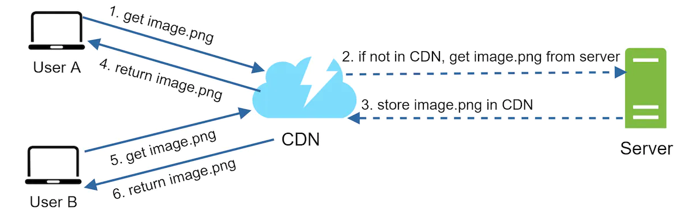
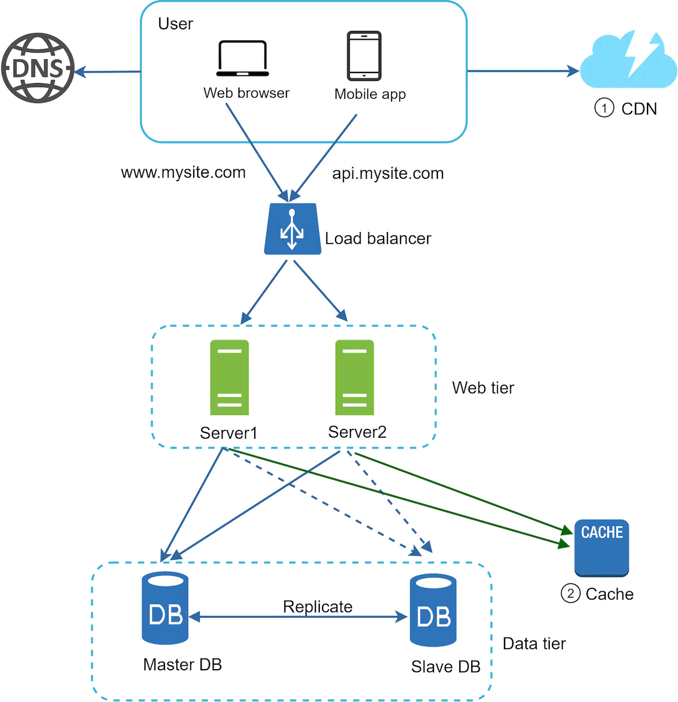

## Content delivery network (CDN)

- CDN is a network of geographically dispersed servers used to deliver static content.
- CDN servers cache static content like images, videos, CSS, JS files etc.
- Dynamic content caching enables the caching of e.g. HTML pages that are based on request path, query strings, cookies, and request headers.
- CDN server closest to the user will deliver content. Further the slower. e.g. if CDN servers are in San Francisco, LA is faster than Europe.

1. The URL's domain is provided by the CDN provider. (e.g. https://mysite.cloudfront.net/logo.jpg)
2. if the CDN server does not have image.png in the cache, it requests the file from the origin i.e. web server or online storage like Amazon s3
3. The origin returns the image.png to the CDN server, which includes optional HTTP header TTL (Time-to-Live), which describes how long the image is cached.
4. The CDN caches the image and returns it to User A.
5. User B sends a request to get the same image.
6. The image is returned from the cache as long as the TTL has not expired.

### Considerations of using a CDN

- **Cost**: Caching infrequently used assets provides no significant benefits so you should consider moving them out of the CDN.
- **Setting an appropriate cache expiry**: stale data vs repeat reloading of content
- **CDN fallback**: If there is a temp CDN outage, clients should be able to detect the problem and request resources from the origin.
- **Invalidating files** using APIs provided by CDN vendors or using object versioning (e.g. adding a parameter to the URL, like image.png?v=2)

- Static assets (JS, CSS, images, etc.) are no longer served by web servers.
- Db load is lightened
