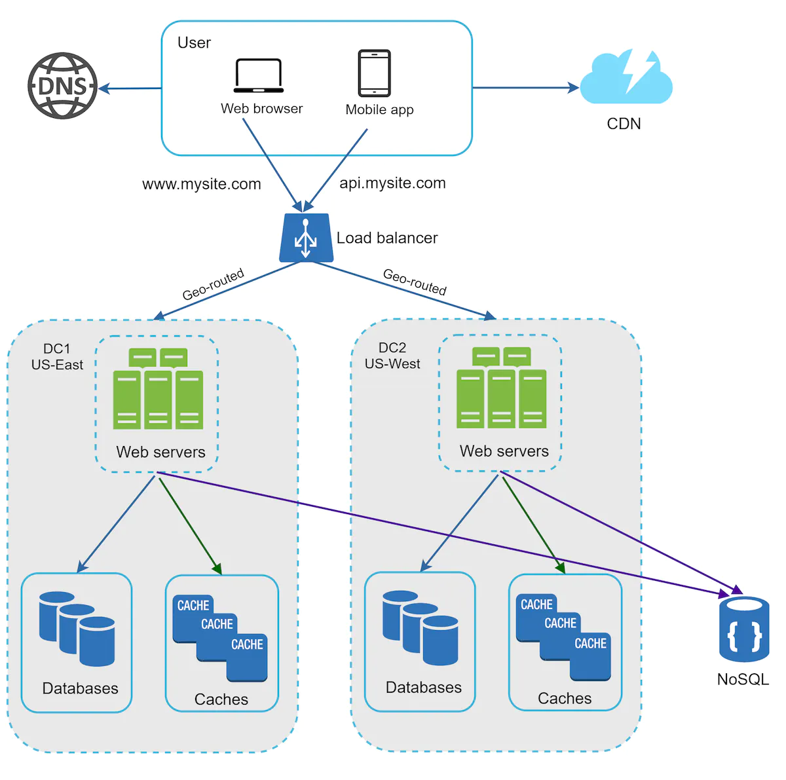

### Data centers

- geoDNS is a DNS service that allows domain names to be resolved to IP addresses based on the location of a user.
- Below, users are geoDNS-routed, also aka geo-routed, to the closest data center, with a split traffic of x% in US-East and (100 - x)% in US-West.

Some technical challenges for multi-data center setup:
- Traffic redirection: e.g. GeoDNS
- Data syncronization: users may use different local dbs or caches. Replicating data across multiple data centers.
- Test and deployment: Testing your app at different locations. Automated deployment tools are vital to keep services consistent.
