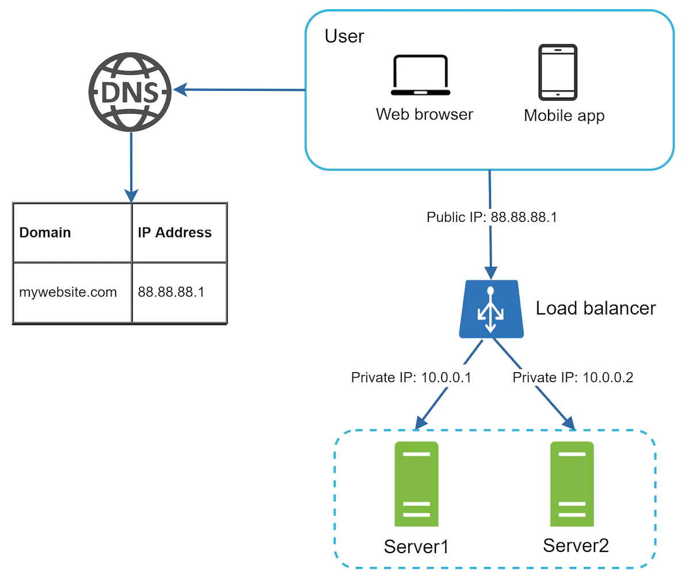

### Which databases to use?

Non-Relational databases:

- Popular ones are CouchDB, Neo4j, Cassandra, HBase, Amazon DynamoDB, etc.
- 4 categories:
  - key-value stores
  - graph stores
  - column stores
  - document stores.
- Might be the right choice if:
  - Your application requires super-low latency.
  - Your data are unstructured, or you do not have any relational data.
  - You only need to serialize and deserialize data (JSON, XML, YAML, etc.)
  - You need to store a massive amount of data.

### Vertical scaling vs Horizontal Scaling

Vertical Scaling: "scale up"

- Adding more CPU, RAM, etc to your servers.
- When traffic is low, it's a great option.
- it has a hard limit, impossible to add unlimited CPU and RAMto a single server.
- does not have failover and redundancy. If one server goes down, the website/app goes down with it completely.

Horizontal Scaling: "scale-out"

- Adding more servers into your pool of resources.
- desirable for large scale applications.

### Load Balancer

- Evenly distributes incoming traffic among web servers.
- Users -> Public IP of the load balancer -> private IPs of servers.
- A private IP is reachable only between servers in the same network; however, it is unreachable over the internet.

### Database Replication

- Usually master-slave relationship or original and the copies. (vs decentralized)
- Master: only writes; slave: only reads, gets copies from the master.
Advantages:
- Better performance: more queries to be performed in parallel.
- Reliability: data is preserved.
- High availability: even if a database is offline, you can access to other db servers.

