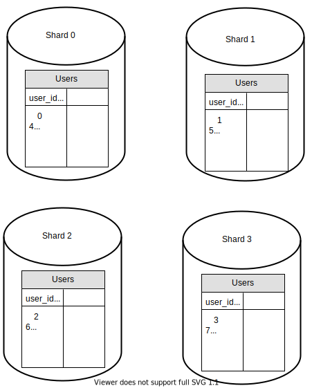

### DB Scaling

#### 1. Vertical Scaling

- "Scaling Up"
- Scaling by adding more power (CPU, RAM, DISK etc) to an existing machine.
- Some examples:
    - [Acc to Amazon Relational Database](https://aws.amazon.com/ec2/instance-types/high-memory/) Service(RDS), you can get a db server with 24 TB of RAM.
    - stackoverflow.com in 2013 had over 10 million monthly unique visitors, but it only had 1 master database, [acc to this link](https://nickcraver.com/blog/2013/11/22/what-it-takes-to-run-stack-overflow/)
    Some numbers to compare, avg monthly unique visitors for fb: 2.9 billion, for amazon 2.4 billion, for reddit > 1billion.
- Some serious drawbacks:
    - Hardware limits, if you have a larger user base a single server is not enough.
    - Greater risk of single point failures.
    - Overall cost is high. Powerful servers are much more expensive.

#### 2. Horizontal Scaling

- "Sharding", separating large dbs into smaller, more easily managed parts called shards.
- Practice of adding more servers.
- Each shard shares the same schema, though the actual data on each is unique to the shard.
- An example of user data that is allocated to a db server based on `user_id`s:

- user_id % 4 is used as the hash function. If the result equals to 0, shard 0 is used to store and fetch data. If the result equals to 1, shard 1 is used. The same logic applies to other shards. The user table in sharded dbs:

- The most important factor to consider when implementing a sharding strategy is the choice of the sharding key to distribute data evenly.In this example, `user_id` is the sharding key (aka partition key).
- Sharding key consists of one or more columns that determine how data is distributed.
- Some complexities and new challenges:
    - **Resharding data** might be needed when 
        1. a shard could no longer hold more data due to rapid growth
        2. certain shards may experience *shard exhaustion* faster than others due to uneven data distribution. When it happens, it requires updating the shard function and moving data around. Consistent hashing is a commonly used technique to solve this problem.
    - **Celebrity problem**, also called as hotspot key problem, refers to excessive access to a specific shard which may cause server overload. Imagine for a social application, Ronaldo, Messi and Gomez ([most followed accounts acc to wikipedia](https://en.wikipedia.org/wiki/List_of_most-followed_Instagram_accounts)) all end up on the same shard which will be overwhemles with read operations. To solve this, we may need to allocate a shard for each celebrity, each shard might even require further partition.
    - **Join and de-normalization**: Once a db has been sharded across multiple servers, it is hard to perform join operations across database shards. A common workaround is to de-normalize the database so that queries can be performed in a single table.

