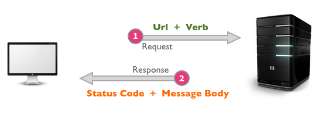

> From the curriculum of [Odin Project](https://www.theodinproject.com/courses/ruby-on-rails/lessons/a-railsy-web-refresher)

### HTTP

HTTP is just a way of structuring the request-and-response conversation between your browser and the server. Actually, it’s not even a conversation since it is stateless… it’s more of an “ask and receive”. The protocol outlines how that brief piece of dialogue should occur.

One key component to pay attention to is the fact that the request and response both have header and (usually) body components. The header contains information about the request or response itself (meta data), including which website to send or return to and what the status of the response is. The body of the request can contain things like data submitted by a form or cookies or authentication tokens while the response will usually contain the HTML page you’re trying to access.

The other key component is that each request uses one of four main “verbs” – GET, POST, PUT, and DELETE. These days, you almost only see GET and POST requests (even if you’re trying to do a delete of something they usually fake it using a POST request), but it’s important to understand the difference between the verbs.

Please check [this file](./http.md) for more about HTTP.

> From [this link](https://code.tutsplus.com/tutorials/http-the-protocol-every-web-developer-must-know-part-1--net-31177)

HTTP stands for Hypertext Transfer Protocol. It's a stateless, application-layer protocol for communicating between distributed systems, and is the foundation of the modern web.

## HTTP Basics

HTTP allows for communication between a variety of hosts and clients, and supports a mixture of network configurations.

The communication usually takes place over TCP/IP, but any reliable transport can be used. The default port for TCP/IP is 80, but other ports can also be used.

- Custom headers can also be created and sent by the client.

HTTP/1.1 adds a few extra features to the previous 1.0 version. These includes *persistent connections, chunked transfer-coding* and *fine-grained caching headers*.

### URLs

At the heart of web communications is the request message, which are sent via Uniform Resource Locators (URLs). URLs have a simple structure that consists of the following components:


The protocol is typically `http`, but it can also be https for secure communications. The default port is `80`, but one can be set explicitly, as illustrated in the above image. The resource path is the *local path* to the resource on the server.

### Verbs

There are several actions that a client would like the host to perform. HTTP has formalized on a few that capture the essentials that are universally applicable for all kinds of applications.

- **GET**: *fetch* an existing resource. The URL contains all the necessary information the server needs to locate and return the resource.
- **POST**: *create* a new resource. POST requests usually carry a payload that specifies the data for the new resource.
- **PUT**: *update* an existing resource. The payload may contain the updated data for the resource.
- **DELETE**: *delete* an existing resource.

`PUT` and `DELETE are sometimes considered specialized versions of the `POST` verb, and they may be packaged as `POST` requests with the payload containing the exact action: *create*, *update* or *delete*.

There are some lesser used verbs that HTTP also supports:

- **HEAD**: this is similar to GET, but without the message body. It's used to retrieve the server headers for a particular resource, generally to check if the resource has changed, via timestamps.
- **TRACE**: used to retrieve the hops that a request takes to round trip from the server. Each intermediate proxy or gateway would inject its IP or DNS name into the `Via` header field. This can be used for diagnostic purposes.
- **OPTIONS**: used to retrieve the server capabilities. On the client-side, it can be used to modify the request based on what the server can support.

### Status Codes

With URLs and verbs, the client can initiate requests to the server. In return, the server responds with status codes and message payloads. The status code is important and tells the client how to interpret the server response. The HTTP spec defines certain number ranges for specific types of responses:

#### 1xx: Informational Messages

*All HTTP/1.1 clients are required to accept the `Transfer-Encoding` header.*

This class of codes was introduced in HTTP/1.1 and is purely provisional. The server can send a `Expect: 100-continue` message, telling the client to continue sending the remainder of the request, or ignore if it has already sent it. HTTP/1.0 clients are supposed to ignore this header.

#### 2xx: Successful

This tells the client that the request was successfully processed. The most common code is **200 OK**. For a `GET` request, the server sends the resource in the message body. There are other less frequently used codes:

- **202** Accepted: the request was accepted but may not include the resource in the response. This is useful for async processing on the server side. The server may choose to send information for monitoring.
- **204** No Content: there is no message body in the response.
- **205** Reset Content: indicates to the client to reset its document view.
- **206** Partial Content: indicates that the response only contains partial content. Additional headers indicate the exact range and content expiration information.

#### 3xx: Redirection

This requires the client to take additional action. The most common use-case is to jump to a different URL in order to fetch the resource.

- **301** Moved Permanently: the resource is now located at a new URL.
- **303** See Other: the resource is temporarily located at a new URL. The `Location` response header contains the temporary URL.
- **304** Not Modified: the server has determined that the resource has not changed and the client should use its cached copy. This relies on the fact that the client is sending `ETag` (Enttity Tag) information that is a hash of the content. The server compares this with its own computed `ETag` to check for modifications.

#### 4xx: Client Error

These codes are used when the server thinks that the client is at fault, either by requesting an invalid resource or making a bad request. The most popular code in this class is **404 Not Found**, which I think everyone will identify with. 404 indicates that the resource is invalid and does not exist on the server. The other codes in this class include:

- **400** Bad Request: the request was malformed.
- **401** Unauthorized: request requires authentication. The client can repeat the request with the `Authorization` header. If the client already included the `Authorization` header, then the credentials were wrong.
- **403** Forbidden: server has denied access to the resource.
- **405** Method Not Allowed: invalid HTTP verb used in the request line, or the server does not support that verb.
- **409** Conflict: the server could not complete the request because the client is trying to modify a resource that is newer than the client's timestamp. Conflicts arise mostly for PUT requests during collaborative edits on a resource.

#### 5xx: Server Error

This class of codes are used to indicate a server failure while processing the request. The most commonly used error code is **500 Internal Server Error**. The others in this class are:

- **501 Not Implemented**: the server does not yet support the requested functionality.
- **503 Service Unavailable**: this could happen if an internal system on the server has failed or the server is overloaded. Typically, the server won't even respond and the request will timeout.

### Request and Response Message Formats

So far, we've seen that *URL*s, *verbs* and *status codes* make up the fundamental pieces of an HTTP request/response pair.



The HTTP specification states that a request or response message has the following generic structure:

```
message = <start-line>
          *(<message-header>)
          CRLF
          [<message-body>]

<start-line> = Request-Line | Status-Line
<message-header> = Field-Name ':' Field-Value
```

It's mandatory to place a new line between the message headers and body. The message can contain one or more headers, of which are broadly classified into:

- [general headers](http://www.w3.org/Protocols/rfc2616/rfc2616-sec4.html#sec4.5): that are applicable for both request and response messages.
- [request specific headers](http://www.w3.org/Protocols/rfc2616/rfc2616-sec5.html#sec5.3).
- [response specific headers](http://www.w3.org/Protocols/rfc2616/rfc2616-sec6.html#sec6.2).
- [entity headers](http://www.w3.org/Protocols/rfc2616/rfc2616-sec7.html#sec7.1).


The message body may contain the complete entity data, or it may be piecemeal if the chunked encoding (`Transfer-Encoding: chunked`) is used. All HTTP/1.1 clients are required to accept the `Transfer-Encoding` header.

#### General Headers

There are a few headers (general headers) that are shared by both request and response messages.

#### Entity Headers

Request and Response messages may also include entity headers to provide meta-information about the the content (aka Message Body or Entity).

> Custom headers can also be created and sent by the client; they will be treated as entity headers by the HTTP protocol.

### Request Format

A typical request message might look like:

```
GET /articles/http-basics HTTP/1.1
Host: www.articles.com
Connection: keep-alive
Cache-Control: no-cache
Pragma: no-cache
Accept: text/html,application/xhtml+xml,application/xml;q=0.9,*/*;q=0.8
```

Note the request line followed by many request headers. The **Host** header is mandatory for HTTP/1.1 clients. **GET** requests do not have a message body, but **POST** requests can contain the post data in the body.

#### Response Format

The response format is similar to the request message, except for the status line and headers. The status line has the following structure:

```
Status-Line = HTTP-Version SP Status-Code SP Reason-Phrase
```

- `SP` is the space separator between the tokens.
- HTTP-Version is sent as `HTTP/1.1`
- The Status-Code is one of the many statuses discussed earlier.
- The Reason-Phrase is a human-readable version of the status code.

A typical status line for a successful response might look like so:

```
HTTP/1.1 200 OK
```


