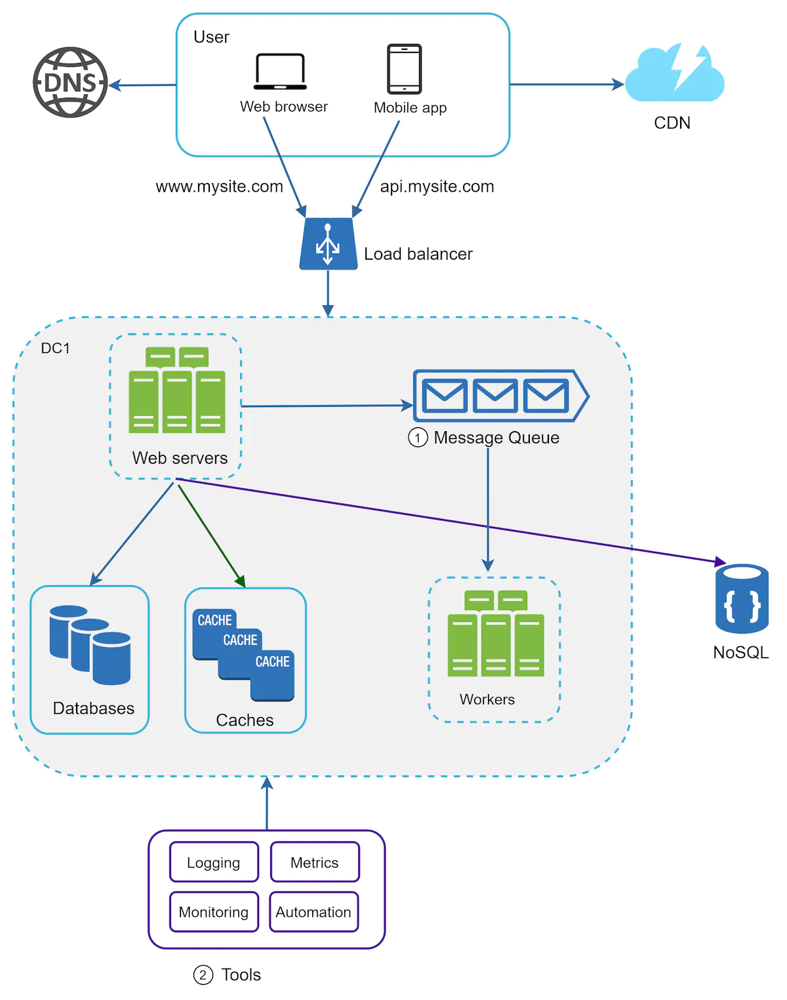

### Logging, metrics, automation

- **Logging**: you may monitor error logs at per server level or use tools to aggregate them to a centralized service for easy search and viewing.
- **Metrics**: understand the health status of the system and gain business insights. Some examples are
    - Host level metrics: CPU, Memory, disk I/O etc.
    - Aggregated level metrics: e.g. performance of the entire db tier, cache tier, etc.
    - Key business metrics: daily active users, retention, revenue etc.
- **Automation**: Continuous integration is a good practice. Each code check-in is verifies through automation, allowing teams to detect problems early. Automating the build, test, deploy process improve dev productivity significantly.

Keep in mind that the data center can be scaled in this figure. NoSQL represents an example of a data store for state/session data.

