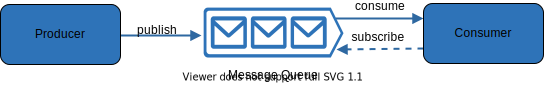
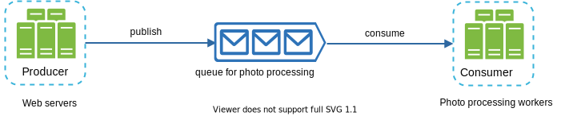

### Message queue

- Serves as a buffer and distributes async requests.
- Input services (producers/publishers) create messages and publish them to a message queue. Other services/servers (consumers/subscribers) connect to the queue and perform actions defined by the messages.

- Decoupling producer and consumer. Easier to scale independently. Example use case: your app supports photo customisation e.g. cropping, blurring etc. web servers publish photo processing jobs to the message queue. Photo processing workers pick up jobs from the message queue and asynchronously perform photo customization tasks. When the size of the queue becomes large, more workers are added to reduce the processing time. However, if the queue is empty most of the time, the number of workers can be reduced.

