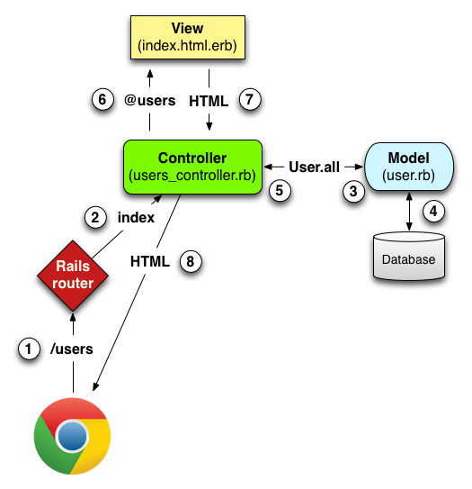

# From toy_project from [Michael Hartl's book](https://www.railstutorial.org/book/toy_app)

------------

#### `rails db:migrate` vs 'rake db:migrate':

It is important to note that in every version of Rails before Rails 5, the `db:migrate` command used `rake` in place of rails, so for the sake of legacy applications it’s important to know how to use Rake.


> **Rake**

> In the Unix tradition, the [Make](https://en.wikipedia.org/wiki/Make_(software)) utility has played an important role in building executable programs from source code. *Rake* is *Ruby make*, a Make-like language written in Ruby.

> Before Rails 5, Ruby on Rails used Rake extensively, so for the sake of legacy Rails applications it’s important to know how to use it. Probably the two most common Rake commands in a Rails context are `rake db:migrate` (to update the database with a data model) and `rake test` (to run the automated test suite). In these and other uses of `rake`, it’s important to ensure that the command uses the version of Rake corresponding to the Rails application’s `Gemfile`, which is accomplished using the Bundler command `bundle exec`. Thus, the migration command

> ```
$ rake db:migrate
```
would be written as

> ```
$ bundle exec rake db:migrate
```

- Rails uses JavaScript to issue the request needed to destroy a user.(If it doesn’t work, be sure that JavaScript is enabled in your browser)

- The name of the scaffold follows the convention of *models*, which are singular, rather than resources and controllers, which are plural. Thus, we have `User` instead of `Users`.

> I need to interrupt here with the article from (korenlc.com)[http://www.korenlc.com/rails-generate-model-vs-resourse-vs-scaffold/]
> Please see the link above for details about the differences among `model`, `resource` and `scaffold`

A detailed diagram of MVC in Rails.


Here is a summary of the steps

1. The browser issues a request for the `/users` URL.
2. Rails routes `/users` to the `index` action in the Users controller.
3. The `index` action asks the User model to retrieve all users (`User.all`).
4. The User model pulls all the users from the database.
5. The User model returns the list of users to the controller.
6. The controller captures the users in the `@users` variable, which is passed to the `index` view.
7. The view uses embedded Ruby to render the page as HTML.
8. The controller passes the HTML back to the browser.


- You may notice that there are more actions than there are pages; the `index`, `show`, `new`, and `edit` actions all correspond to pages, but there are additional `create`, `update`, and `destroy` actions as well. These actions don’t typically render pages (although they can); instead, their main purpose is to modify information about users in the database. This full suite of controller actions represents the implementation of the REST architecture in Rails, which is based on the ideas of *representational state transfer* identified and named by computer scientist Roy Fielding. There is some overlap in the URLs; for example, both the user `show` action and the `update` action correspond to the URL /users/1. The difference between them is the HTTP request method they respond to.

> ####  REpresentational State Transfer (REST)

> REST is an architectural style for developing distributed, networked systems and software applications such as the World Wide Web and web applications.

> In the context of Rails applications REST means that most application components (such as users and microposts) are modeled as *resources* that can be created, read, updated, and deleted—operations that correspond both to the CRUD operations of relational databases and to the four fundamental HTTP request methods: `POST`, `GET`, `PATCH`, and `DELETE`.

> As a Rails application developer, the RESTful style of development helps you make choices about which controllers and actions to write: you simply structure the application using resources that get created, read, updated, and deleted. In the case of users and microposts, this process is straightforward, since they are naturally resources in their own right.


In `application_controller.rb`

```
class ApplicationController < ActionController::Base
...
```

In `application_record.rb`

```
class ApplicationRecord < ActiveRecord::Base
...
```


