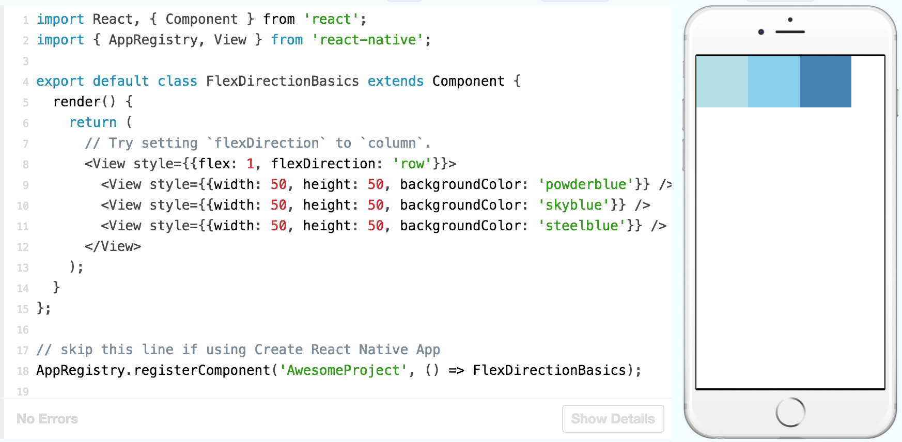
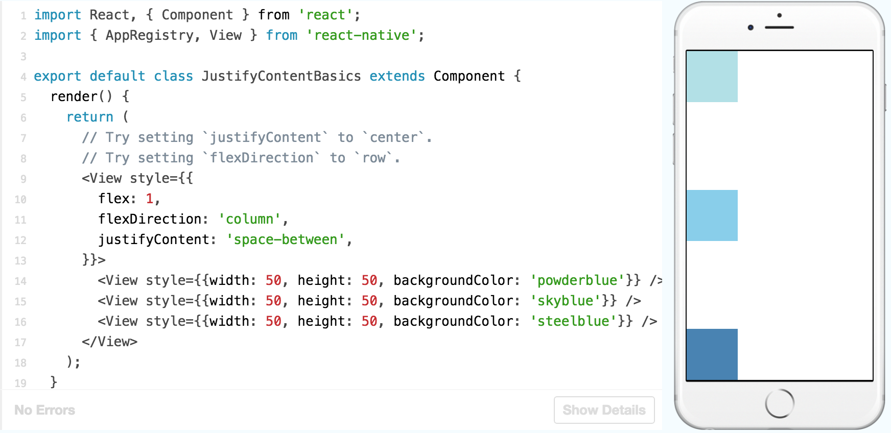
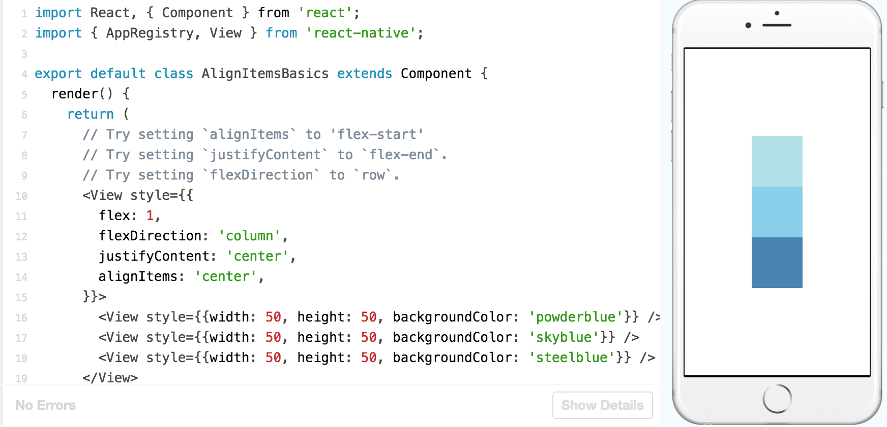

From [Fb documentation](https://facebook.github.io/react-native/docs/tutorial.html)

# The Basics

## Learn The Basics

React Native is like React, but it uses native components instead of web components as building blocks.

#### Hello World!

```
import React, { Component } from 'react';
import { Text } from 'react-native';

export default class HelloWorldApp extends Component {
  render() {
    return (
      <Text>Hello world!</Text>
    );
  }
```

#### What's going on?

- First of all, ES2015 (also known as ES6) is a set of improvements to JavaScript that is now part of the official standard, but not yet supported by all browsers, so often it isn't used yet in web development. React Native ships with ES2015 support, so you can use this stuff without worrying about compatibility.  `import`, `from`, `class`, `extends`, and the `() =>` syntax in the example above are all ES2015 features. (To have a goog overview of ES2015 features, please visit [this page](https://babeljs.io/learn-es2015/))

- The other unusual thing in this code example is `<Text>Hello world!</Text>`. This is JSX - a syntax for embedding XML within JavaScript.

#### Components

So this code is defining `HelloWorldApp`, a new `Component`. Anything you see on the screen is some sort of component. A component can be pretty simple - the only thing that's required is a `render` function which returns some JSX to render.

## Props

Most components can be customized when they are created, with different parameters. These creation parameters are called `props`.

For example, one basic React Native component is the `Image`. When you create an image, you can use a prop named `source` to control what image it shows.

```
import React, { Component } from 'react';
import { AppRegistry, Image } from 'react-native';

export default class Bananas extends Component {
  render() {
    let pic = {
      uri: 'https://upload.wikimedia.org/wikipedia/commons/d/de/Bananavarieties.jpg'
    };
    return (
      <Image source={pic} style={{width: 193, height: 110}}/>
    );
  }
}

// skip this line if using Create React Native App
AppRegistry.registerComponent('AwesomeProject', () => Bananas);
```
Notice that `{pic}` is surrounded by braces, to embed the variable `pic` into JSX. You can put any JavaScript expression inside braces in JSX.

Your own components can also use `props`. This lets you make a single component that is used in many different places in your app, with slightly different properties in each place. Just refer to `this.props` in your `render` function. Here's an example:

```
import React, { Component } from 'react';
import { AppRegistry, Text, View } from 'react-native';

class Greeting extends Component {
  render() {
    return (
      <Text>Hello {this.props.name}!</Text>
    );
  }
}

export default class LotsOfGreetings extends Component {
  render() {
    return (
      <View style={{alignItems: 'center'}}>
        <Greeting name='Rexxar' />
        <Greeting name='Jaina' />
        <Greeting name='Valeera' />
      </View>
    );
  }
}

// skip this line if using Create React Native App
AppRegistry.registerComponent('AwesomeProject', () => LotsOfGreetings);
```
Using `name` as a prop lets us customize the `Greeting` component, so we can reuse that component for each of our greetings. This example also uses the `Greeting` component in JSX, just like the built-in components. The power to do this is what makes React so cool - if you find yourself wishing that you had a different set of UI primitives to work with, you just invent new ones.

The other new thing going on here is the `View` component. A View is useful as a container for other components, to help control style and layout.

## State

There are two types of data that control a component: `props` and `state`. `props` are set by the parent and they are fixed throughout the lifetime of a component. For data that is going to change, we have to use `state`.

In general, you should initialize `state` in the constructor, and then call `setState` when you want to change it.

For example, let's say we want to make text that blinks all the time. The text itself gets set once when the blinking component gets created, so the text itself is a `prop`. The "whether the text is currently on or off" changes over time, so that should be kept in `state`.

```
import React, { Component } from 'react';
import { AppRegistry, Text, View } from 'react-native';

class Blink extends Component {
  constructor(props) {
    super(props);
    this.state = {isShowingText: true};

    // Toggle the state every second
    setInterval(() => {
      this.setState(previousState => {
        return { isShowingText: !previousState.isShowingText };
      });
    }, 1000);
  }

  render() {
    let display = this.state.isShowingText ? this.props.text : ' ';
    return (
      <Text>{display}</Text>
    );
  }
}

export default class BlinkApp extends Component {
  render() {
    return (
      <View>
        <Blink text='I love to blink' />
        <Blink text='Yes blinking is so great' />
        <Blink text='Why did they ever take this out of HTML' />
        <Blink text='Look at me look at me look at me' />
      </View>
    );
  }
}

// skip this line if using Create React Native App
AppRegistry.registerComponent('AwesomeProject', () => BlinkApp);
```
In a real application, you probably won't be setting state with a timer. You might set state when you have new data arrive from the server, or from user input. You can also use a state container like [Redux](https://redux.js.org/) to control your data flow. In that case you would use Redux to modify your state rather than calling `setState` directly.

When setState is called, BlinkApp will re-render its Component. By calling setState within the Timer, the component will re-render every time the Timer ticks.

## Style

As a component grows in complexity, it is often cleaner to use `StyleSheet.create` to define several styles in one place. Here's an example:

```
...

const styles = StyleSheet.create({
  bigblue: {
    color: 'blue',
    fontWeight: 'bold',
    fontSize: 30,
  },
  red: {
    color: 'red',
  },
});

...
```
One common pattern is to make your component accept a `style` prop.

There are a lot more ways to customize text style. Check out the [Text component reference](https://facebook.github.io/react-native/docs/text.html) for a complete list. The next step in becoming a style master is to [learn how to control component size](https://facebook.github.io/react-native/docs/height-and-width.html).

## Height and Width

#### Fixed Dimensions

All dimensions in React Native are unitless, and represent density-independent pixels. Setting dimensions this way is common for components that should always render at exactly the same size, regardless of screen dimensions.

#### Flex Dimensions

 Normally you will use `flex: 1`, which tells a component to fill all available space, shared evenly amongst each other component with the same parent. The larger the `flex` given, the higher the ratio of space a component will take compared to its siblings.

> A component can only expand to fill available space if its parent has dimensions greater than 0. If a parent does not have either a fixed `width` and `height` or `flex`, the parent will have dimensions of 0 and the `flex` children will not be visible.

## Layout with Flexbox

A component can specify the layout of its children using the flexbox algorithm. Flexbox is designed to provide a consistent layout on different screen sizes.

You will normally use a combination of `flexDirection`, `alignItems`, and `justifyContent` to achieve the right layout.

##### Flex Direction

Adding `flexDirection` to a component's `style` determines the **primary axis** of its layout. Should the children be organized horizontally (`row`) or vertically (`column`)? The default is `column`.



##### Justify Content

Adding `justifyContent` to a component's style determines the **distribution** of children along the **primary axis**. Should children be distributed at the start, the center, the end, or spaced evenly? Available options are `flex-start`, `center`, `flex-end`, `space-around`, `space-between` and `space-evenly`.



##### Align Items

Adding `alignItems` to a component's style determines the **alignment** of children along the **secondary axis** (if the primary axis is `row`, then the secondary is `column`, and vice versa). Available options are `flex-start`, `center`, `flex-end`, and `stretch`.

> For `stretch` to have an effect, children must not have a fixed dimension along the secondary axis. In the following example, setting `alignItems: stretch` does nothing until the `width: 50` is removed from the children.



The full list of props that control layout is documented [here](https://facebook.github.io/react-native/docs/layout-props.html).

## Handling TextInput

`TextInput` is a basic component that allows the user to enter text. It has an `onChangeText` prop that takes a function to be called every time the text changed, and an `onSubmitEditing` prop that takes a function to be called when the text is submitted.

For example, let's say that as the user types, you're translating their words into a different language. In this new language, every single word is written the same way: 🍕. So the sentence "Hello there Bob" would be translated as "🍕🍕🍕".

```
import React, { Component } from 'react';
import { AppRegistry, Text, TextInput, View } from 'react-native';

export default class PizzaTranslator extends Component {
  constructor(props) {
    super(props);
    this.state = {text: ''};
  }

  render() {
    return (
      <View style={{padding: 10}}>
        <TextInput
          style={{height: 40}}
          placeholder="Type here to translate!"
          onChangeText={(text) => this.setState({text})}
        />
        <Text style={{padding: 10, fontSize: 42}}>
          {this.state.text.split(' ').map((word) => word && '🍕').join(' ')}
        </Text>
      </View>
    );
  }
}

// skip this line if using Create React Native App
AppRegistry.registerComponent('AwesomeProject', () => PizzaTranslator);
```

There are a lot more things you might want to do with a text input. For example, you could validate the text inside while the user types. For more detailed examples, see the [React docs on controlled components](https://reactjs.org/docs/forms.html#controlled-components), or the [reference docs for TextInput](https://facebook.github.io/react-native/docs/textinput.html).

## Handling Touches

React Native provides components to handle all sorts of common gestures(such as tapping on a button, scrolling a list, or zooming on a map), as well as a comprehensive [gesture responder system](https://facebook.github.io/react-native/docs/gesture-responder-system.html) to allow for more advanced gesture recognition, but the one component you will most likely be interested in is the basic Button.

#### Displaying a basic button

The minimal example to display a button looks like this:

```
<Button
  onPress={() => {
    Alert.alert('You tapped the button!');
  }}
  title="Press Me"
/>
```

Pressing the button will call the "onPress" function, which in this case displays an alert popup.

To play with button options please visit the [link](https://facebook.github.io/react-native/docs/handling-touches.html)

#### Touchables

If the basic button doesn't look right for your app, you can build your own button using any of the "Touchable" components provided by React Native. The "Touchable" components provide the capability to capture tapping gestures, and can display feedback when a gesture is recognized. These components do not provide any default styling, however, so you will need to do a bit of work to get them looking nicely in your app.
	- Generally, you can use [TouchableHighlight](https://facebook.github.io/react-native/docs/touchablehighlight.html) anywhere you would use a button or link on web. The view's background will be darkened when the user presses down on the button.
	- You may consider using [TouchableNativeFeedback](https://facebook.github.io/react-native/docs/touchablenativefeedback.html) on Android to display ink surface reaction ripples that respond to the user's touch.
	- [TouchableOpacity](https://facebook.github.io/react-native/docs/touchableopacity.html) can be used to provide feedback by reducing the opacity of the button, allowing the background to be seen through while the user is pressing down.
	- If you need to handle a tap gesture but you don't want any feedback to be displayed, use [TouchableWithoutFeedback](https://facebook.github.io/react-native/docs/touchablewithoutfeedback.html).

In some cases, you may want to detect when a user presses and holds a view for a set amount of time. These long presses can be handled by passing a function to the `onLongPress` props of any of the "Touchable" components.

To play with button options please visit the [link](https://snack.expo.io/?session_id=snack-session-rkbWoUS-Q)

## Using a ScrollView

The ScrollView is a generic scrolling container that can host multiple components and views. The scrollable items need not be homogeneous, and you can scroll both vertically and horizontally (by setting the `horizontal` property).

ScrollViews can be configured to allow paging through views using swiping gestures by using the `pagingEnabled` props. Swiping horizontally between views can also be implemented on Android using the [ViewPagerAndroid](https://facebook.github.io/react-native/docs/viewpagerandroid.html) component.

A ScrollView with a single item can be used to allow the user to zoom content. Set up the `maximumZoomScale` and `minimumZoomScale` props and your user will be able to use pinch and expand gestures to zoom in and out.

The ScrollView works best to present a small amount of things of a limited size. All the elements and views of a `ScrollView` are rendered, even if they are not currently shown on the screen. If you have a long list of more items than can fit on the screen, you should use a `FlatList` instead.

## Using List Views

React Native provides a suite of components for presenting lists of data. Generally, you'll want to use either [FlatList](https://facebook.github.io/react-native/docs/flatlist.html) or [SectionList](https://facebook.github.io/react-native/docs/sectionlist.html).

The `FlatList` component displays a scrolling list of changing, but similarly structured, data. `FlatList` works well for long lists of data, where the number of items might change over time. Unlike the more generic `ScrollView`, the `FlatList` only renders elements that are currently showing on the screen, not all the elements at once.

The `FlatList` component requires two props: `data` and `renderItem`. `data` is the source of information for the list. `renderItem` takes one item from the source and returns a formatted component to render.

To play with button options please visit the [link](https://snack.expo.io/?session_id=snack-session-BkoJWPSWQ)

If you want to render a set of data broken into logical sections, maybe with section headers, similar to `UITableViews` on iOS, then a [SectionList](https://facebook.github.io/react-native/docs/sectionlist.html) is the way to go.

To play with button options please visit the [link](https://snack.expo.io/?session_id=snack-session-S15xZPrWm)

## Networking

#### Using Fetch

React Native provides the [Fetch API](https://developer.mozilla.org/en-US/docs/Web/API/Fetch_API) for your networking needs. Fetch will seem familiar if you have used `XMLHttpRequest` or other networking APIs before. You may refer to MDN's guide on [Using Fetch](https://developer.mozilla.org/en-US/docs/Web/API/Fetch_API/Using_Fetch) for additional information.

##### Making Requests

```
fetch('https://mywebsite.com/mydata.json');
```
Fetch also takes an optional second argument that allows you to customize the HTTP request. You may want to specify additional headers, or make a POST request:

```
fetch('https://mywebsite.com/endpoint/', {
  method: 'POST',
  headers: {
    Accept: 'application/json',
    'Content-Type': 'application/json',
  },
  body: JSON.stringify({
    firstParam: 'yourValue',
    secondParam: 'yourOtherValue',
  }),
});
```
Take a look at the [Fetch Request docs](https://developer.mozilla.org/en-US/docs/Web/API/Request) for a full list of properties.

##### Handling the response

Networking is an inherently asynchronous operation. Fetch methods will return a [Promise](https://developer.mozilla.org/en-US/docs/Web/JavaScript/Reference/Global_Objects/Promise) that makes it straightforward to write code that works in an asynchronous manner:

```
function getMoviesFromApiAsync() {
  return fetch('https://facebook.github.io/react-native/movies.json')
    .then((response) => response.json())
    .then((responseJson) => {
      return responseJson.movies;
    })
    .catch((error) => {
      console.error(error);
    });
}
```

- Check the [link](https://facebook.github.io/react-native/docs/network.html) for the usage of ES2017 `async/await` syntax in React Native app.

> By default, iOS will block any request that's not encrypted using SSL. If you need to fetch from a cleartext URL (one that begins with `http`) you will first need to [add an App Transport Security exception](https://facebook.github.io/react-native/docs/integration-with-existing-apps.html#test-your-integration). If you know ahead of time what domains you will need access to, it is more secure to add exceptions just for those domains; if the domains are not known until runtime you can [disable ATS completely](https://facebook.github.io/react-native/docs/integration-with-existing-apps.html#app-transport-security). Note however that from January 2017, [Apple's App Store review will require reasonable justification for disabling ATS](https://forums.developer.apple.com/thread/48979). See [Apple's documentation](https://developer.apple.com/library/ios/documentation/General/Reference/InfoPlistKeyReference/Articles/CocoaKeys.html#//apple_ref/doc/uid/TP40009251-SW33) for more information.

##### Using Other Networking Libraries

The [XMLHttpRequest API](https://developer.mozilla.org/en-US/docs/Web/API/XMLHttpRequest) is built in to React Native. This means that you can use third party libraries such as [frisbee](https://github.com/niftylettuce/frisbee) or [axios](https://github.com/mzabriskie/axios) that depend on it, or you can use the XMLHttpRequest API directly if you prefer.

```
var request = new XMLHttpRequest();
request.onreadystatechange = (e) => {
  if (request.readyState !== 4) {
    return;
  }

  if (request.status === 200) {
    console.log('success', request.responseText);
  } else {
    console.warn('error');
  }
};

request.open('GET', 'https://mywebsite.com/endpoint/');
request.send();
```

> The security model for XMLHttpRequest is different than on web as there is no concept of [CORS](http://en.wikipedia.org/wiki/Cross-origin_resource_sharing) in native apps.

#### WebSocket Support

React Native also supports [WebSockets](https://developer.mozilla.org/en-US/docs/Web/API/WebSocket), a protocol which provides full-duplex communication channels over a single TCP connection.

```
var ws = new WebSocket('ws://host.com/path');

ws.onopen = () => {
  // connection opened
  ws.send('something'); // send a message
};

ws.onmessage = (e) => {
  // a message was received
  console.log(e.data);
};

ws.onerror = (e) => {
  // an error occurred
  console.log(e.message);
};

ws.onclose = (e) => {
  // connection closed
  console.log(e.code, e.reason);
};
```

## More Resources

#### Popular Libraries

If you're using React Native, you probably already know about [React](https://facebook.github.io/react/). So I feel a bit silly mentioning this. But if you haven't, check out React - it's the best way to build a modern website.

One common question is how to handle the "state" of your React Native application. The most popular library for this is [Redux](http://redux.js.org/). Don't be afraid of how often Redux uses the word "reducer" - it's a pretty simple library, and there's also a nice [series of videos](https://egghead.io/courses/getting-started-with-redux) explaining it.

If you're looking for a library that does a specific thing, check out [Awesome React Native](http://www.awesome-react-native.com/), a curated list of components that also has demos, articles, and other stuff.

#### Examples

Try out apps from the [Showcase](https://facebook.github.io/react-native/showcase.html) to see what React Native is capable of! There are also some [example apps on GitHub](https://github.com/ReactNativeNews/React-Native-Apps). You can run the apps on a simulator or device, and you can see the source code for these apps, which is neat.

The folks who built the app for Facebook's F8 conference also [open-sourced the code](https://github.com/fbsamples/f8app) and wrote up a [detailed series of tutorials](http://makeitopen.com/). This is useful if you want a more in-depth example that's more realistic than most sample apps out there.

#### Extending React Native

- Fellow developers write and publish React Native modules to npm and open source them on GitHub.

- Read the guides on Native Modules ([iOS](https://facebook.github.io/react-native/docs/native-modules-ios.html), [Android](https://facebook.github.io/react-native/docs/native-modules-android.html)) and Native UI Components ([iOS](https://facebook.github.io/react-native/docs/native-components-ios.html), [Android](https://facebook.github.io/react-native/docs/native-components-android.html)) if you are interested in extending native functionality.

- Looking for a pre-built component? [Check JS.coach](https://js.coach/react-native).

#### Development Tools

[Nuclide](https://nuclide.io/) is the IDE that Facebook uses internally for JavaScript development. The killer feature of Nuclide is its debugging ability. It also has great inline Flow support. [VS Code](https://code.visualstudio.com/) is another IDE that is popular with JavaScript developers.

For more please visit the [page](https://facebook.github.io/react-native/docs/more-resources.html#development-tools)

#### Where React Native People Hang Out

Please visit the [link](https://facebook.github.io/react-native/docs/more-resources.html#where-react-native-people-hang-out)


