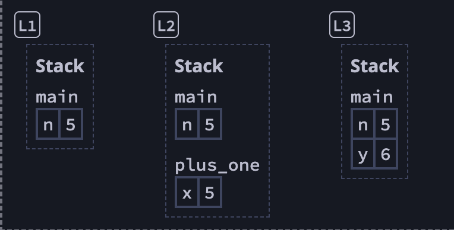
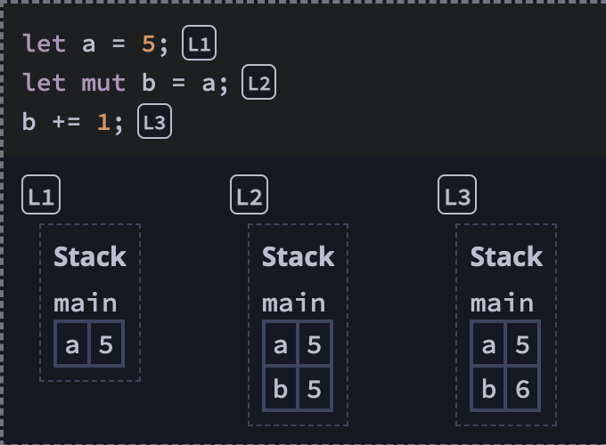
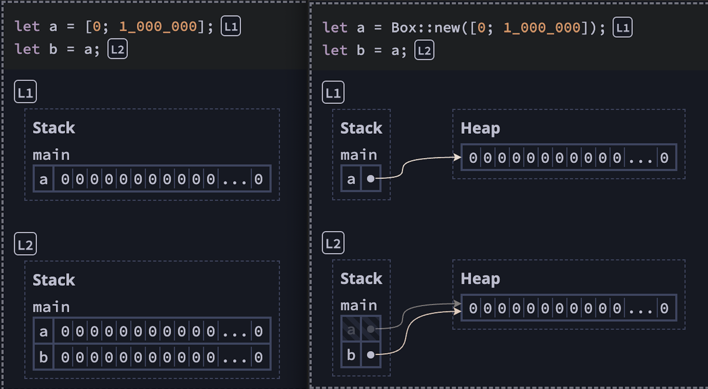
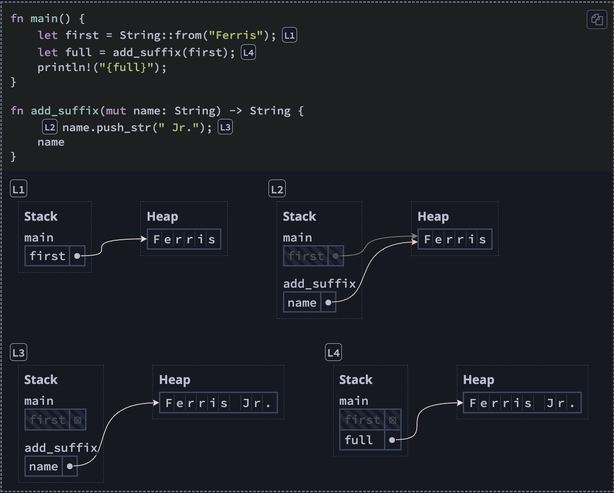
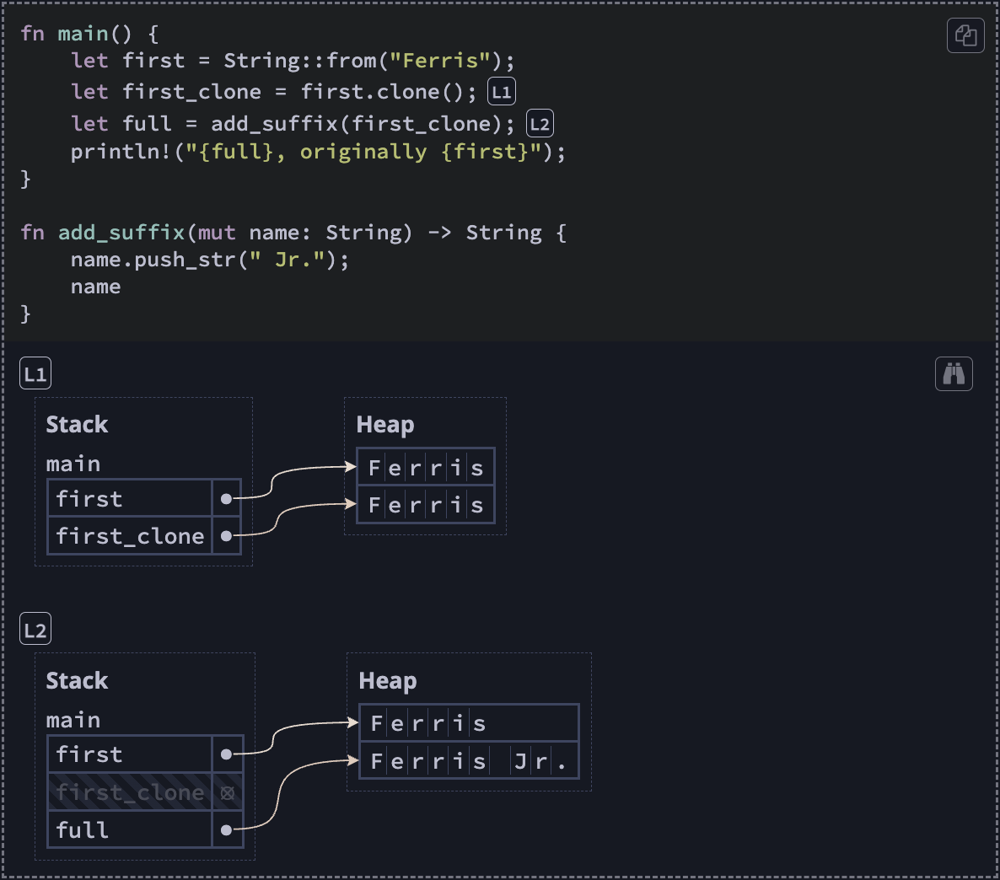

<!-- from this book: https://rust-book.cs.brown.edu/ -->

## 1. Getting Started

    $ rustc --version
    $ rustup update
    $ rustup self uninstall


    $ rustc main.rs // compiling
    $ ./main // running


    $ rustup component add rustfmt
    $ cargo fmt // cargo is Rust's build system and package manager.


    println!("Hello, world!")

notice `!` that means it's calling a macro instead of normal function. Macros don't always follow the same rules as functions. More in Chapter 19.

    $ cargo new hello_cargo

It creates a new directory and project called hello_cargo and creates its files in a directory of the same name.

    $ cargo build
creates an executable file in target/debug/hello_cargo. Cargo puts the binary in a directory named debug.

To run the executable:

    ./target/debug/hello_cargo
    Hello, world!

We can also use

    $ cargo run
to build and run in one go.

    $ cargo check
to quickly check and make sure the code compiles, but doesn't produce an executable.

    $ cargo build --release
to compile it with optimizations. Creates an executable in *target/release* instead of *target/debug*
When benchmarking your code's running time, run `cargo build --release` and benchmark with the executable in target/release.

to work on any existing projects

    $ git clone example.org/someproject
    $ cd someproject
    $ cargo build


## 2. Programming a Guessing Game:

    let apples = 5; // immutable
    let mut bananas = 5; // mutable

    let x = 5;
    let y = 10;

    println!("x = {} and y = {}", x, y);
    // will print x = 5 and y = 10

`crate` is a collection of Rust source code files. This project is a *binary crate*, which is an executable. The e.g. `rand` crate is a *library crate*, which contains code intended to be used in other programs and can't be executed on its own.

    // Filename: Cargo.toml
    rand = "0.8.3"

Cargo understands Semantic Versioning (sometimes called *SemVer*), which is a standard for writing version numbers. The number `0.8.3` is actually shorthand for `^0.8.3`, which means any version that is at least `0.8.3` but below `0.9.0`

When we include an external dependency, Cargo fetches the latest versions of everything that dependency needs from the *registry*, which is a copy of data from `Crates.io`. Crates.io is where people in the Rust ecosystem post their open source Rust projects for others to use. After updating the registry, Cargo checks the `[dependencies]` section and downloads any crates listed that aren’t already downloaded.

    cargo update

It will ignore the *Cargo.lock* file and figure out all the latest versions that fit your specifications in *Cargo.toml*. Cargo will then write those versions to the *Cargo.lock* file. Otherwise, by default, Cargo will only look for versions greater than `0.8.3` and less than `0.9.0`.

    let secret_number = rand::thread_rng().gen_range(1..=100);

When we call the `rand::thread_rng` function that gives us the particular random number generator that we’re going to use: one that is local to the current thread of execution and seeded by the operating system.

    cargo doc --open

This command will build documentation provided by all of your dependencies locally and open it in your browser.

    match guess.cmp(&secret_number) {
        Ordering::Less => println!("Too small!"),
        Ordering::Greater => println!("Too big!"),
        Ordering::Equal => println!("You win!"),
    }

A `match` expression is made up of *arms*. An arm consists of a pattern to match against, and the code that should be run if the value given to `match` fits that arm’s pattern. Rust takes the value given to `match` and looks through each arm’s pattern in turn.

## 3. Common Programming Concepts

### 3.1. Variables and Mutability

```
fn main() {
    let x = 5;
    println!("The value of x is: {x}");
    x = 6;
    println!("The value of x is: {x}");
}
```

```
$ cargo run
   Compiling variables v0.1.0 (file:///projects/variables)
error[E0384]: cannot assign twice to immutable variable `x`
 --> src/main.rs:4:5
  |
2 |     let x = 5;
  |         -
  |         |
  |         first assignment to `x`
  |         help: consider making this binding mutable: `mut x`
3 |     println!("The value of x is: {x}");
4 |     x = 6;
  |     ^^^^^ cannot assign twice to immutable variable

For more information about this error, try `rustc --explain E0384`.
error: could not compile `variables` due to previous error
```

```
fn main() {
    let mut x = 5;
    println!("The value of x is: {x}");
    x = 6;
    println!("The value of x is: {x}");
}
```

```
$ cargo run
   Compiling variables v0.1.0 (file:///projects/variables)
    Finished dev [unoptimized + debuginfo] target(s) in 0.30s
     Running `target/debug/variables`
The value of x is: 5
The value of x is: 6
```

#### Constants

```
const THREE_HOURS_IN_SECONDS: u32 = 60 * 60 * 30;
```

#### Shadowing

```
fn main() {
    let x = 5;

    let x = x + 1;

    {
        let x = x * 2;
        println!("The value of x in the inner scope is: {x}");
    }

    println!("The value of x is: {x}");
}
```

```
$ cargo run
   Compiling variables v0.1.0 (file:///projects/variables)
    Finished dev [unoptimized + debuginfo] target(s) in 0.31s
     Running `target/debug/variables`
The value of x in the inner scope is: 12
The value of x is: 6
```

mut vs let:
- reassign: We’ll get a compile-time error if we accidentally try to reassign to this variable without using the let keyword.
- changeable type and reusable variable: when we use the let keyword again, we can change the type of the value but reuse the same name.

```
let spaces = "   ";
let spaces = spaces.len();
```
Shadowing thus spares us from having to come up with different names, such as spaces_str and spaces_num; instead, we can reuse the simpler spaces name

### 3.2 Data Types

Rust is a statically typed language, which means that it must know the types of all variables at compile time.

#### 3.2.1 Scalar Types

A scalar type represents a single value. Four primary scalar types: integers, floating-point numbers, Booleans, and characters.

##### Integer Types

- `u32` declaration indicates that the value it’s associated with should be an unsigned integer (signed integer types start with i instead of u) that takes up 32 bits of space. signed: the number can be negative; unsigned: it can only be positive so represented without a sign.
- `i8`: -128 to 127; `u8`: 0 to 255.
- the `isize` and `usize` types depend on the architecture of the computer your program is running on, which is denoted in the table as “arch”: 64 bits if you’re on a 64-bit architecture and 32 bits if you’re on a 32-bit architecture.
- So how do you know which type of integer to use? If you’re unsure, Rust’s defaults are generally good places to start: integer types default to i32. The primary situation in which you’d use isize or usize is when indexing some sort of collection.
- integer overflow:
    - when compiling in debug mode, Rust includes checks for integer overflow that cause your program to panic at runtime if this behavior occurs.
    - when compiling in release mode, Rust does *not* include checks for integer overflow that cause panics. Instead, if overflow occurs, Rust performs *two’s complement wrapping*. In short, values greater than the maximum value the type can hold “wrap around” to the minimum of the values the type can hold. In the case of a u8, the value 256 becomes 0, the value 257 becomes 1, and so on. The program won’t panic, but the variable will have a value that probably isn’t what you were expecting it to have. Relying on integer overflow’s wrapping behavior is considered an error.
- Handle integer overflow with one of these families of methods: `wrapping_*`, `checked_*`, `overflowing_*`, `saturating_*`.

##### Floating-Point Types

- The default type is `f64` because on modern CPUs, it’s roughly the same speed as f32 but is capable of more precision. All floating-point types are signed.

```
fn main() {
    let x = 2.0; // f64

    let y: f32 = 3.0; // f32
}
```

##### Numeric Operations

```
fn main() {
    // addition
    let sum = 5 + 10;

    // subtraction
    let difference = 95.5 - 4.3;

    // multiplication
    let product = 4 * 30;

    // division
    let quotient = 56.7 / 32.2;
    let truncated = -5 / 3; // Results in -1

    // remainder
    let remainder = 43 % 5;
}
```

##### The Boolean Type

Booleans are one byte in size.
```
fn main() {
    let t = true;

    let f: bool = false; // with explicit type annotation
}
```

##### The Character Type

```
fn main() {
    let c = 'z';
    let z: char = 'ℤ'; // with explicit type annotation
    let heart_eyed_cat = '😻';
}
```

- `char` literals are specified with `'`, while string literals use `"`.
- Rust’s char type is four bytes in size and represents a Unicode Scalar Value, which means it can represent a lot more than just ASCII. Accented letters; Chinese, Japanese, and Korean characters; emoji; and zero-width spaces are all valid char values in Rust.

#### 3.2.2 Compound Types

Rust has 2 primitive compound types: tuples and arrays

##### The Tuple Type

- Tuples have a fixed length: once declared, they cannot grow or shrink in size.
- The tuple without any values has a special name, `unit`. Written as `()`.
- destructuring:
```
fn main() {
    let tup = (500, 6.4, 1);

    let (x, y, z) = tup;

    println!("The value of y is: {y}");
}
```

```
fn main() {
    let x: (i32, f64, u8) = (500, 6.4, 1);

    let five_hundred = x.0;

    let six_point_four = x.1;

    let one = x.2;
}
```

##### The Array Type

- Unlike tuple, every element of an array must have the same type.
- Arrays in Rust have a fixed length.
- Arrays are useful when you want your data allocated on the stack rather than the heap.
- A `vector` is a similar collection type provided by the standard library that is allowed to grow or shrink in size.
- Use arrays when you know the number of elements won't change, e.g. months; otherwise use vectors.
- Write an array’s type using square brackets with the type of each element, a semicolon, and then the number of elements in the array, like so:
```
let a: [i32; 5] = [1, 2, 3, 4, 5];
```
You can also initialize an array to contain the same value:
```
let a = [3; 5];
```
This is the same as writing `let a = [3, 3, 3, 3, 3];` but in a more concise way.

Accessing array elements:
```
fn main() {
    let a = [1, 2, 3, 4, 5];

    let first = a[0];
    let second = a[1];
}
```
When you attempt to access an element using indexing, Rust will check that the index you’ve specified is less than the array length. If the index is greater than or equal to the length, Rust will panic. This is an example of Rust’s memory safety principles in action. Rust protects you against this kind of error by immediately exiting instead of allowing the memory access and continuing.

### 3.3 Functions

Rust doesn’t care where you define your functions, only that they’re defined somewhere in a scope that can be seen by the caller.

#### Parameters

We can define functions to have *parameters*, which are special variables that are part of a function’s signature. When a function has parameters, you can provide it with concrete values for those parameters. Technically, the concrete values are called *arguments*, but in casual conversation, people tend to use the words *parameter* and *argument* interchangeably for either the variables in a function’s definition or the concrete values passed in when you call a function.

```
fn main() {
    print_labeled_measurement(5, 'h');
}

fn print_labeled_measurement(value: i32, unit_label: char) {
    println!("The measurement is: {value}{unit_label}");
}
```
In function signatures, type annotation for each parameter is required.

#### Statements and Expressions

- Statements are instructions that perform some action and do not return a value. e.g. `let y = 6`
- Expressions evaluate to a resultant value. `5 + 6`

    fn main() {
        let y = 6;
    }

Creating a variable and assigning a value to it with the let keyword as in above is a statement. Function definitions are also statements.


You can’t assign a let statement to another variable, as the following code tries to do; you’ll get an error:
```
fn main() {
    let x = (let y = 6);
}
```

The let y = 6 statement does not return a value, so there isn’t anything for x to bind to. Different than C and Ruby, where the assignment returns the value of the assignment. In those languages, you can write x = y = 6 and have both x and y have the value 6; that is not the case in Rust.

Expressions can be part of statements: in the example above, the 6 in the statement let y = 6; is an expression that evaluates to the value 6. Calling a function is an expression. Calling a macro is an expression. A new scope block created with curly brackets is an expression, for example:

```
fn main() {
    let y = {
        let x = 3;
        x + 1
    };

    println!("The value of y is: {y}");
}
```

This expression:
```
{
    let x = 3;
    x + 1
}
```
is a block that, in this case, evaluates to 4. That value gets bound to y as part of the let statement. Note that the x + 1 line doesn’t have a semicolon at the end, which is unlike most of the lines you’ve seen so far. Expressions do not include ending semicolons. If you add a semicolon to the end of an expression, you turn it into a statement, and it will then not return a value. Keep this in mind as you explore function return values and expressions next.

Another example:
```
fn main() {
    let x = plus_one(5);

    println!("The value of x is: {x}");
}

fn plus_one(x: i32) -> i32 {
    x + 1
}
```
This code will print `The value of x is: 6`. Let's add a `;`:

```
fn main() {
    let x = plus_one(5);

    println!("The value of x is: {x}");
}

fn plus_one(x: i32) -> i32 {
    x + 1;
}
```
Compiling this code produces an error, as follows:
```
$ cargo run
   Compiling functions v0.1.0 (file:///projects/functions)
error[E0308]: mismatched types
 --> src/main.rs:7:24
  |
7 | fn plus_one(x: i32) -> i32 {
  |    --------            ^^^ expected `i32`, found `()`
  |    |
  |    implicitly returns `()` as its body has no tail or `return` expression
8 |     x + 1;
  |          - help: remove this semicolon to return this value

For more information about this error, try `rustc --explain E0308`.
error: could not compile `functions` due to previous error
```

### 3.4 Comments

```
fn main() {
    // I’m feeling lucky today
    let lucky_number = 7;
}
```

### 3.5 Control Flow

#### if Expressions

```
fn main() {
    let number = 6;

    if number % 4 == 0 {
        println!("number is divisible by 4");
    } else if number % 3 == 0 {
        println!("number is divisible by 3");
    } else if number % 2 == 0 {
        println!("number is divisible by 2");
    } else {
        println!("number is not divisible by 4, 3, or 2");
    }
}
```
Because if is an expression, we can use it on the right side of a let statement to assign the outcome to a variable
```
fn main() {
    let condition = true;
    let number = if condition { 5 } else { 6 };

    println!("The value of number is: {number}");
}
```
```
$ cargo run
   Compiling branches v0.1.0 (file:///projects/branches)
    Finished dev [unoptimized + debuginfo] target(s) in 0.30s
     Running `target/debug/branches`
The value of number is: 5
```
the results of both the if arm and the else arm were i32 integers. If the types are mismatched, as in the following example, we’ll get an error.

#### Repetition with Loops

```
fn main() {
    let mut counter = 0;

    let result = loop {
        counter += 1;

        if counter == 10 {
            break counter * 2;
        }
    };

    println!("The result is {result}");
}
// Prints "The result is 20".
```

####  Loop Labels to Disambiguate Between Multiple Loops

If you have loops within loops, break and continue apply to the innermost loop at that point. You can optionally specify a loop label on a loop that you can then use with break or continue to specify that those keywords apply to the labeled loop instead of the innermost loop. Loop labels must begin with a single quote.

```
fn main() {
    let mut count = 0;
    'counting_up: loop {
        println!("count = {count}");
        let mut remaining = 10;

        loop {
            println!("remaining = {remaining}");
            if remaining == 9 {
                break;
            }
            if count == 2 {
                break 'counting_up;
            }
            remaining -= 1;
        }

        count += 1;
    }
    println!("End count = {count}");
}
```

```
$ cargo run
   Compiling loops v0.1.0 (file:///projects/loops)
    Finished dev [unoptimized + debuginfo] target(s) in 0.58s
     Running `target/debug/loops`
count = 0
remaining = 10
remaining = 9
count = 1
remaining = 10
remaining = 9
count = 2
remaining = 10
End count = 2
```

#### Conditional Loops with while

```
fn main() {
    let mut number = 3;

    while number != 0 {
        println!("{number}!");

        number -= 1;
    }

    println!("LIFTOFF!!!");
}
```

#### Looping Through a Collection with for

```
fn main() {
    for number in (1..4).rev() {
        println!("{number}!");
    }
    println!("LIFTOFF!!!");
}
```

## 4. Understanding Ownership

It enables Rust to make memory safety guarantees without needing a garbage collector.

### 4.1. What is Ownership?

#### Safety is the Absence of Undefined Behaviour

Rust's goal is to compile programs into efficient binaries that require as few runtime checks as possible. Therefore Rust does not check at runtime whether a variable is defined before being used. Instead, Rust checks at compile-time.

1. A foundational goal of Rust is to ensure that your programs never have undefined behavior. That is the meaning of "safety." Undefined behavior is especially dangerous for low-level programs with direct access to memory. About [70% of reported security vulnerabilities](https://msrc.microsoft.com/blog/2019/07/a-proactive-approach-to-more-secure-code/) in low-level systems are caused by memory corruption, which is one form of undefined behavior.
2. A secondary goal of Rust is to prevent undefined behavior at compile-time instead of run-time. This goal has two motivations:
    - Catching bugs at compile-time means avoiding those bugs in production, improving the reliability of your software.
    - Catching bugs at compile-time means fewer runtime checks for those bugs, improving the performance of your software.

#### Variables Live in the Stack

```
fn main() {
    let n = 5;
    let y = plus_one(n);
    println!("The value of y is: {y}");
}

fn plus_one(x: i32) -> i32 {
    x + 1
}
```

Variables live in **frames**. A frame is a mapping from variables to values within a single scope, such as a function.

Frames are organized into a **stack** of currently-called-functions. For example, at L2 the frame for `main` sits above the frame for the called function `plus_one`. After a function returns, Rust deallocates the function's frame. (Deallocation is also called **freeing** or **dropping**, and we use those terms interchangeably.) This sequence of frames is called a stack because the most recent frame added is always the next frame freed.

> Note: this memory model does not fully describe how Rust actually works! As we saw earlier with the assembly code, the Rust compiler might put `n` or `x` into a register rather than a stack frame. But that distinction is an implementation detail. It shouldn't change your understanding of safety in Rust, so we can focus on the simpler case of frame-only variables.

When an expression reads a variable, the variable's value is copied from its slot in the stack frame. For example, if we run this program:



The value of `a` is copied into `b`, and `a` is left unchanged, even after changing `b`.

#### Boxes Live in the Heap

However, copying data can take up a lot of memory. Consider an array with 1 million elements:

```
let a = [0; 1_000_000];
let b = a;
```

Copying a into b causes the `main` frame to contain 2 million elements.

To transfer access to data without copying it, Rust uses **pointers**. A pointer is a value that describes a location in memory. One common way to make a pointer is to allocate memory in the **heap**. The heap is a separate region of memory where data can live indefinitely. Heap data is not tied to a specific stack frame. Rust provides a construct called `Box` for putting data on the heap. For example, we can wrap the million-element array in `Box::new` like this:



Observe that now, there is only ever a single array at `a` time. At L1, the value of a is a pointer (represented by dot with an arrow) to the array inside the heap. The statement `let b = a` copies the pointer from `a` into `b`, but the pointed-to data is not copied. Note that `a` is now grayed out because it has been *moved* — we will see what that means in a moment.

#### Rust does not permit manual memeory management

Stack frames are automatically managed by Rust. When a function is called, Rust allocates a stack frame for the called function. When the call ends, Rust deallocates the stack frame.

#### A Box's Owner Manages Deallocation

Instead, Rust automatically frees a box's heap memory. What happens when we bind two variables to a box?

```
let a = Box::new([0; 1_000_000]);
let b = a;
```

**Ownership**: When `a` is bound to `Box::new([0; 1_000_000])`, we say that `a` **owns** the box. The statement `let b = a` **moves** ownership of the box from `a` to `b`.

> If a variable owns a box, when Rust deallocates the variable's frame, then Rust deallocates the box's heap memory.

In the example above, `b` owns the boxed array. Therefore when the scope ends, Rust deallocates the box only once on behalf of `b`, not `a`.

#### Collections Use Boxes



- At L1, the string "Ferris" has been allocated on the heap. It is owned by first.
- At L2, the function add_suffix(first) has been called. This moves ownership of the string from first to name. The string data is not copied, but the pointer to the data is copied.
- At L3, the function name.push_str(" Jr.") resizes the string's heap allocation. This does three things. First, it creates a new larger allocation. Second, it writes "Ferris Jr." into the new allocation. Third, it frees the original heap memory. first now points to deallocated memory.
- At L4, the frame for add_suffix is gone. This function returned name, transferring ownership of the string to full.

#### Variables Cannot Be Used After Being Moved

> **Moved heap data principle**: if a variable x moves ownership of heap data to another variable y, then x cannot be used after the move.

#### Cloning Avoids Moves

Use `.clone()`:



Observe that at L1, `first_clone` did not "shallow" copy the pointer in `first`, but instead "deep" copied the string data into a new heap allocation. Therefore at L2, while `first_clone` has been moved and invalidated by `add_suffix`, the original `first` variable is unchanged. It is safe to continue using `first`.

Ownership is primarily a discipline of heap management:

- All heap data must be owned by exactly one variable.
- Rust deallocates heap data once its owner goes out of scope.
- Ownership can be transferred by moves, which happen on assignments and function calls.
- Heap data can only be accessed through its current owner, not a previous owner.
