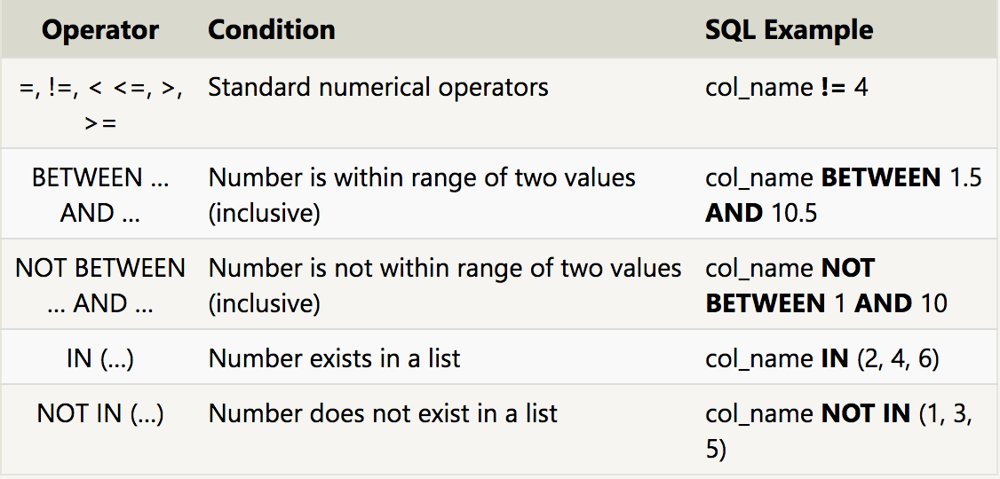
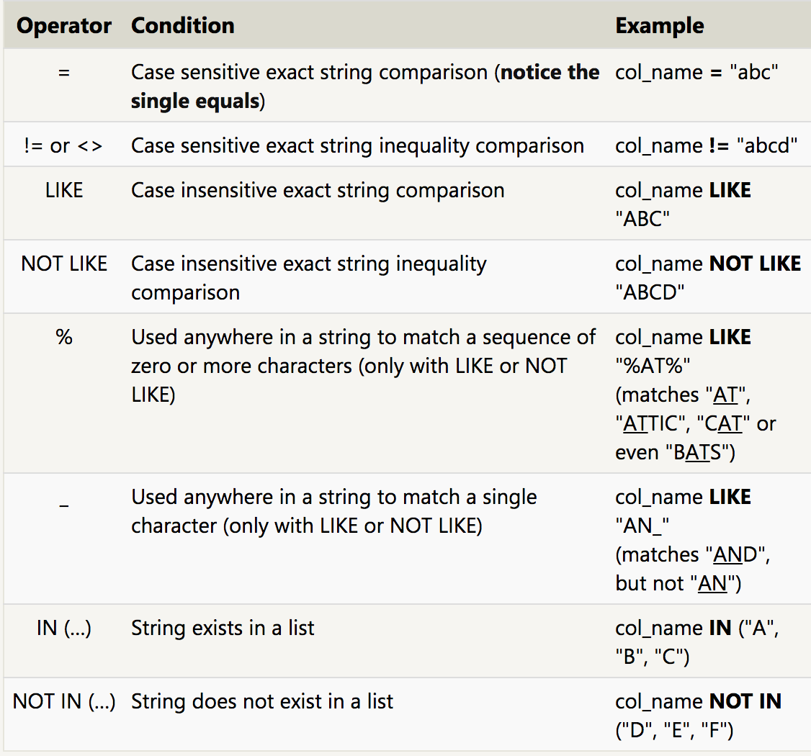
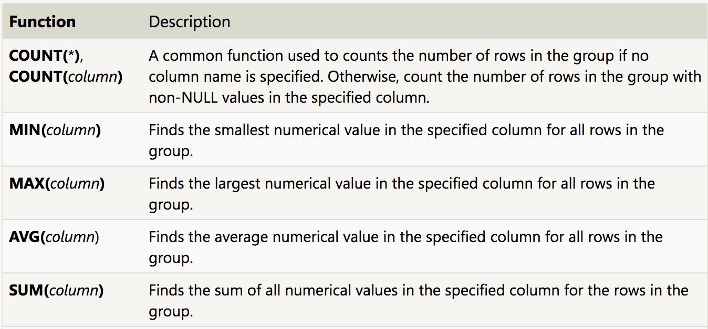
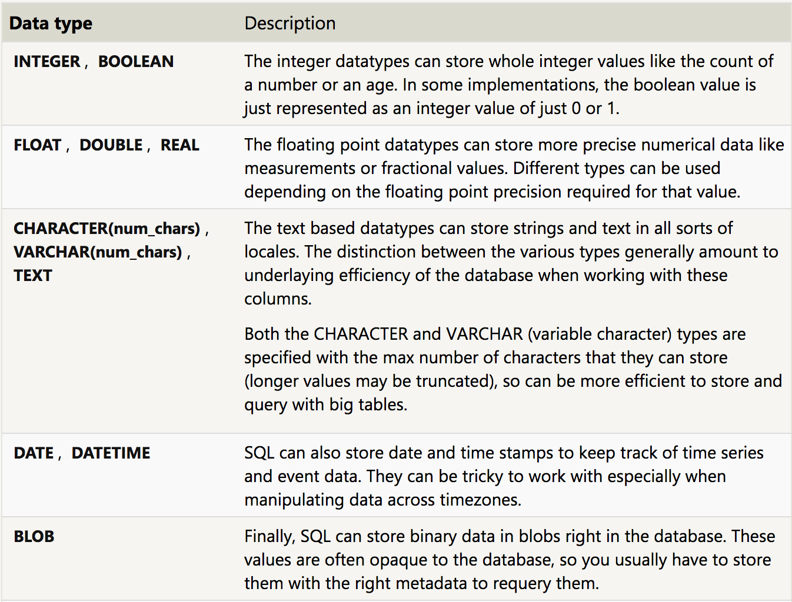
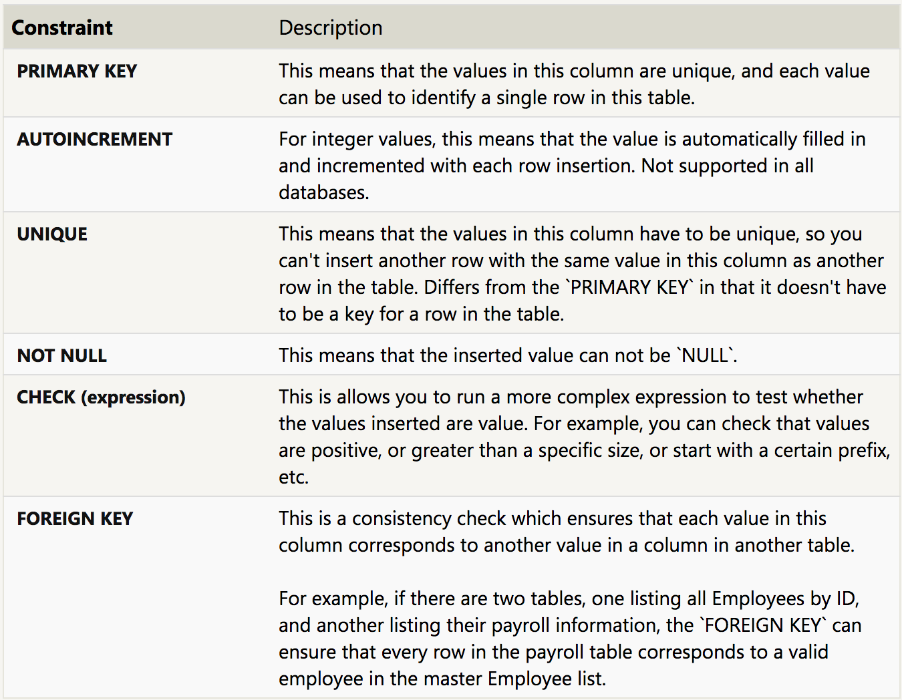

> From [Odin Project's curriculum](https://www.theodinproject.com/courses/databases/lessons/databases)

### Introduction

We’ve talked about the client-side and the server-side but how do we keep ahold of all our user’s data? Who remembers that your login password is CatLover1985 so you can sign into the website? The bottom layer of any web application is the database and it handles all the remembering for you (we’ll cover caching much later). It can be relatively simple, like an excel spreadsheet, or incredibly complex and split into many giant pieces like Facebook’s.

Compared to a normal programming language like you’ve already learned, SQL (Structured Query Language), which is used to query databases, is a very simple syntax… there are only a small handful of verbs to learn. What trips people up is that you need to be able to visualize in your head what it’s going to be doing.

> From [Odin Project's curriculum](https://www.theodinproject.com/courses/databases/lessons/databases-and-sql)

### The World’s Fastest Semi-Complete Explanation of SQL

#### Setting Stuff Up

The setup information for your database is stored in a special file called the “Schema”, and this is updated whenever you make changes to the structure of your database. Think of the schema as saying “here’s our database and it’s got a couple tables. The first table is ‘users’ and it’s got columns for ‘ID’ (which is an integer), ‘name’ (which is a bunch of characters), ‘email’ (which is a bunch of characters) …”

In addition to setting up tables, you can tell your database to only allow unique values in a particular column (e.g. for usernames) or to index a column for faster searching later with `CREATE INDEX`. Create indexes, which basically do all the hard work of sorting your table ahead of time, for columns that you’ll likely be using to search on later (like username)… it will make your database much faster.

SQL likes semicolons at the end of lines and using single quotes (‘) instead of double quotes(“).

#### Mucking Around With Data

You can do all kinds of common sense things like using `>`, `<`, `<=` etc. comparison operators to specify groups of rows to run commands on or logical operators like `AND`, `OR`, `NOT` etc to chain multiple clauses together, e.g. `DELETE * FROM users WHERE id > 12 AND name = 'foo'`.

“Create” queries use `INSERT INTO` and you’ll need to specify which columns to insert stuff into and then which values to put in those columns, which looks something like `INSERT INTO Users (name, email) VALUES ('foobar','foo@bar.com');`.

“Update” queries use `UPDATE` and you’ll need to tell it what data to `SET` (using key=”value” pairs) and which rows to do those updates for. Be careful because if your `WHERE` clause finds multiple rows (e.g. if you’ve searched based on a common first name), they’ll all get updated.

```
UPDATE Users
SET name='barfoo', email='bar@foo.com'
WHERE email='foo@bar.com';
```

“Read” queries, which use `SELECT`, are the most common, e.g. `SELECT * FROM users WHERE created_at < '2013-12-11 15:35:59 -0800'`. If there are more than one table involved use `SELECT users.id, users.name FROM users`. If you want a list of all the different names of your users without any duplicates, try `SELECT DISTINCT users.name FROM users`.

#### Mashing Tables Together

- `INNER JOIN`, aka `JOIN`: `SELECT * FROM TableA INNER JOIN TableB ON TableA.name = TableB.name`

- `LEFT OUTER JOIN`: `SELECT * FROM TableA LEFT OUTER JOIN TableB ON TableA.name = TableB.name`. For A\B: `SELECT * FROM TableA LEFT OUTER JOIN TableB ON TableA.name = TableB.name WHERE TableB.id IS null`

- `RIGHT OUTER JOIN`: the opposite… keep all rows in the right table.

- `FULL OUTER JOIN`: `SELECT * FROM TableA FULL OUTER JOIN TableB ON TableA.name = TableB.name` (A || B). For ((A\B) || (B\A)): `SELECT * FROM TableA FULL OUTER JOIN TableB ON TableA.name = TableB.name WHERE TableA.id IS null OR TableB.id IS null`

#### Using Functions to Aggregate Your Data

Sometimes you want to just return a single relevant value that aggregates a column, like the `COUNT` of posts a user has written. In this case, just use one of the helpful “aggregate” functions offered by SQL (most of which you’d expect to be there – functions like `SUM` and `MIN` and `MAX` etc). You include the function as a part of the `SELECT` statement, like `SELECT MAX(users.age) FROM users`.

You often see aliases (`AS`) used to rename columns or aggregate functions so you can call them by that alias later, e.g. `SELECT MAX(users.age) AS highest_age FROM users` will return a column called `highest_age` with the maximum age in it.

Displaying the `COUNT` of posts for EACH user (as opposed to the count of all posts by all users:

```
SELECT users.name, COUNT(posts.*) AS posts_written
FROM users
JOIN posts ON users.id = posts.user_id
GROUP BY users.name;
```

If you’ve used an aggregate function like `COUNT` (say to get the count of posts written for each user in the example above), `WHERE` won’t work anymore. So to conditionally retrieve records based on aggregate functions, you use the `HAVING` function, which is essentially the `WHERE` for aggregates. So say I only want to display users who have written more than 10 posts:

```
SELECT users.name, COUNT(posts.*) AS posts_written
FROM users
JOIN posts ON users.id = posts.user_id
GROUP BY users.name
HAVING posts_written >= 10;
```

### SQL id faster than Ruby

For instance, if you want all the unique names of your users, you COULD just grab the whole list from your database using SQL like `SELECT users.name FROM users` (which Active Record will do for you with `User.select(:name)`) then remove duplicates using Ruby’s `#uniq` method, e.g. `User.select(:name).uniq`… but that requires you to pull all that data out of your database and then put it into memory and then iterate through it using Ruby. Use `SELECT DISTINCT users.name FROM users` instead to have SQL do it all in one step.

------------

> From [SQL Teaching](https://www.sqlteaching.com/)


```
# returns just the name and species columns
SELECT name, species FROM family_members;
# returns all of the rows that refer to dogs
SELECT * FROM family_members WHERE species = 'dog';
```


```
# finds all of Pickles' friends that are dogs and under the height of 45cm
SELECT * FROM friends_of_pickles WHERE species = 'dog' AND height_cm < 45;
# returns the rows that are not cats or dogs
SELECT * FROM friends_of_pickles WHERE species NOT IN ('cat', 'dog');
# returns a list of the distinct species of animals greater than 50cm in height
SELECT DISTINCT species FROM friends_of_pickles WHERE height_cm > 50;
# sorts the friends_of_pickles by height_cm in descending order
SELECT * FROM friends_of_pickles ORDER BY height_cm DESC;
# return the single row (and all columns) of the tallest friends_of_pickles(Some variants of SQL do not use the `LIMIT` keyword.
)
SELECT * FROM friends_of_pickles ORDER BY height_cm DESC LIMIT 1;
# returns the number of rows in friends_of_pickles where the species is a dog
SELECT COUNT(*) FROM friends_of_pickles WHERE species = 'dog';
# finds the total num_books_read made by this family
SELECT SUM(num_books_read) FROM family_members;
# finds the average num_books_read made by each family member
SELECT AVG(num_books_read) FROM family_members;
# find the highest num_books_read that a family member makes
SELECT MAX(num_books_read) FROM family_members;
# returns the tallest height for each species
SELECT MAX(height_cm), species FROM friends_of_pickles GROUP BY species;
# returns the family members that have the highest num_books_read
SELECT * FROM family_members WHERE num_books_read = (SELECT MAX(num_books_read) FROM family_members);
# returns all of the rows of family_members where favorite_book is not null
SELECT * FROM family_members WHERE favorite_book IS NOT NULL;
```


```
# returns a list of celebrities that were born after September 1st, 1980
SELECT * FROM celebs_born WHERE birthdate > '1980-09-01';
```


```
# an inner join to pair each character name with the actor who plays them
SELECT character.name, character_actor.actor_name
FROM character 
INNER JOIN character_actor 
ON character.id = character_actor.character_id;
```


```
# pairs each character name with the actor who plays them
SELECT character.name, actor.name 
FROM character 
INNER JOIN character_actor 
ON character.id = character_actor.character_id
INNER JOIN actor
ON character_actor.actor_id = actor.id;

# returns a list of characters and TV shows that are not named "Willow Rosenberg" and not in the show "How I Met Your Mother"
SELECT character.name, tv_show.name FROM character 
INNER JOIN character_tv_show
ON character.id = character_tv_show.character_id
INNER JOIN tv_show
ON character_tv_show.tv_show_id = tv_show.id
WHERE character.name != 'Willow Rosenberg' AND tv_show.name != 'How I Met Your Mother'; 
```

#### LIKE

It is to search through text-based values.
- The percent sign (`%`) represents zero, one, or multiple characters.
- The underscore (`_`) represents one character.
- Case insensitive.

```
# returns "Robot" followed by a year between 2000 and 2099? (So 2015 is a valid value at the end, but 2123 is not.) 

SELECT * FROM robots WHERE name LIKE "%Robot 20__";
```

#### SUBSTR

SUBSTR(column_name, index, number_of_characters)

```
SUBSTR(name, 1, 5) is the first 5 characters of the name. 
SUBSTR(name, -4) is the last 4 characters of the name. 
```

```
# returns all of the robots that have been released between 2000 and 2099.

SELECT * FROM robots WHERE SUBSTR(name, -4) LIKE '20__';
```

Note: In other versions of SQL, you could use RIGHT to do this.

#### COALESCE

Takes a list of columns, and returns the value of the first column that is not null.

id | name | gun | sword | tank
--- | --- | --- | --- | --- |
1 | US Marine | Colt 9mm SMG | Swiss Army Knife | M1A1 Abrams Tank
2 | John Wilkes Booth | .44 caliber Derringer | null | null
3 | Zorro | null | Sword of Zorro | null
4 | Innocent Bystander | null | null | null

```
# Suppose we wanted to find the most powerful weapon that a combatant has on hand. If value of gun is not null, that is the value returned. Otherwise, the value of sword is returned. Then you would run: 

SELECT name, COALESCE(gun, sword) as weapon FROM fighters;
```

> From [SQLBolt](https://sqlbolt.com/lesson/introduction)

#### Queries with Constraints

```
SELECT column FROM table WHERE col_name (NOT) BETWEEN 1.5 AND 10.5;
SELECT column FROM table WHERE col_name (NOT) IN (2, 4, 6)
SELECT column FROM table WHERE col_name (NOT) LIKE "TOY STOR_%";
```

#### Filtering and Sorting

```
SELECT DISTINCT column FROM table WHERE conditions;
SELECT column FROM table WHERE conditions ORDER BY column ASC/DESC;
SELECT column FROM table WHERE conditions ORDER BY column ASC/DESC LIMIT num_limit OFFSET num_offset;
# LIMIT will reduce the number of rows to return, and the optional  OFFSET will specify where to begin counting the number rows from.
SELECT DISTINCT Title FROM movies ORDER BY Title ASC LIMIT 5 OFFSET 5;
# List the next five movies sorted alphabetically.
```

---------

> From [SQLBolt](https://sqlbolt.com/)

### 2: Queries with constraints (Pt. 1)



```
SELECT *
FROM Movies
WHERE Year BETWEEN 1999 AND 2010;
```

### 3: Queries with constraints (Pt. 2)



### 4. Filtering and sorting Query results

```
SELECT DISTINCT column, another_column, …
FROM mytable
WHERE condition(s);
```

```
SELECT column, another_column, …
FROM mytable
WHERE condition(s)
ORDER BY column ASC/DESC
LIMIT num_limit OFFSET num_offset;
```

The LIMIT will reduce the number of rows to return, and the optional  OFFSET will specify where to begin counting the number rows from.

```
SELECT DISTINCT Director
FROM movies
ORDER BY Director ASC;
# List all directors of Pixar movies (alphabetically), without duplicates
```

```
SELECT Title
FROM movies
ORDER BY Year DESC
LIMIT 4;
# List the last four Pixar movies released (ordered from most recent to least)
```

```
SELECT Title
FROM movies
ORDER BY Title ASC
LIMIT 5 OFFSET 5;
# List the next five Pixar movies sorted alphabetically
```

### 5. Simple SELECT Queries

```
SELECT City, Population
FROM north_american_cities
WHERE Country LIKE "CANADA";
# List all the Canadian cities and their populations
```

```
SELECT City, Latitude, Longitude
FROM north_american_cities
WHERE Country LIKE "United States%"
ORDER BY Latitude DESC;
# Order all the cities in the United States by their latitude from north to south
```

### 6. Multi-table queries with JOINs

```
SELECT column, another_table_column, …
FROM mytable
INNER JOIN another_table 
    ON mytable.id = another_table.id
WHERE condition(s)
ORDER BY column, … ASC/DESC
LIMIT num_limit OFFSET num_offset;
```

> You might see queries where the INNER JOIN is written simply as a  JOIN. These two are equivalent, but we will continue to refer to these joins as inner-joins because they make the query easier to read once you start using other types of joins, which will be introduced in the following lesson. 

### 7. OUTER JOINs

> You might see queries written these joins written as LEFT OUTER JOIN,  RIGHT OUTER JOIN, or  FULL OUTER JOIN, but the OUTER keyword is really kept for SQL-92 compatibility and these queries are simply equivalent to  LEFT JOIN, RIGHT JOIN, and FULL JOIN respectively.

### 8. A short note on NULLs

```
SELECT column, another_column, …
FROM mytable
WHERE column IS/IS NOT NULL
AND/OR another_condition
AND/OR …;
```

### 9. Queries with expressions

```
SELECT column AS better_column_name, …
FROM a_long_widgets_table_name AS mywidgets
INNER JOIN widget_sales
  ON mywidgets.id = widget_sales.widget_id;

```

```
SELECT particle_speed / 2.0 AS half_particle_speed
FROM physics_data
WHERE ABS(particle_position) * 10.0 > 500;
```

```
SELECT Title, (Domestic_sales + International_sales)/ 1000000 AS Combined_sales
FROM movies
LEFT JOIN Boxoffice
ON Movies.id = Boxoffice.Movie_id;
```

### 10. Queries with aggregates



Find the longest time that an employee has been at the studio

```
SELECT MAX(Years_employed)
FROM employees;
```

For each role, find the average number of years employed by employees in that role 

```
SELECT Role, AVG(Years_employed)
FROM employees
GROUP BY role;
```

Find the total number of employee years worked in each building

```
SELECT Building, SUM(Years_employed)
FROM employees
GROUP BY Building;
```

### 11. Queries with aggregates (Pt. 2)

If the GROUP BY clause is executed after the WHERE clause (which filters the rows which are to be grouped), then how exactly do we filter the grouped rows?

Luckily, SQL allows us to do this by adding an additional HAVING clause which is used specifically with the GROUP BY clause to allow us to filter grouped rows from the result set.

```
SELECT group_by_column, AGG_FUNC(column_expression) AS aggregate_result_alias, …
FROM mytable
WHERE condition
GROUP BY column
HAVING group_condition;
```

Find the number of Employees of each role in the studio:

```
SELECT Role, COUNT(*)
FROM employees
GROUP BY Role;
```

Find the total number of years employed by all Engineers

```
SELECT Role, SUM(Years_employed)
FROM employees
WHERE Role = 'Engineer';
```

### 12. Order of execution of a Query

```
SELECT DISTINCT column, AGG_FUNC(column_or_expression), …
FROM mytable
    JOIN another_table
      ON mytable.column = another_table.column
    WHERE constraint_expression
    GROUP BY column
    HAVING constraint_expression
    ORDER BY column ASC/DESC
    LIMIT count OFFSET COUNT;
```

Find the number of movies each director has directed

```
SELECT Director, Count(*)
FROM movies
GROUP BY Director;
```

Find the total domestic and international sales that can be attributed to each director:

```
SELECT Director, SUM(Domestic_sales + International_sales)
FROM movies
JOIN Boxoffice
ON movies.Id = Boxoffice.Movie_id
GROUP BY Director;
```
(There may be more than one rows for each director)

### 13. Inserting rows

**What is a Schema?**

In SQL, the database schema is what describes the structure of each table, and the datatypes that each column of the table can contain.

In some cases, if you have incomplete data and the table contains columns that support default values, you can insert rows with only the columns of data you have by specifying them explicitly.

```
INSERT INTO mytable
(column, another_column, …)
VALUES (value_or_expr, another_value_or_expr, …),
      (value_or_expr_2, another_value_or_expr_2, …),
      …;
```

### 14. Updating rows

Most people working with SQL will make mistakes updating data at one point or another. Whether it's updating the wrong set of rows in a production database, or accidentally leaving out the WHERE clause (which causes the update to apply to all rows), you need to be extra careful when constructing UPDATE statements.

One helpful tip is to always write the constraint first and test it in a SELECT query to make sure you are updating the right rows, and only then writing the column/value pairs to update.

```
UPDATE mytable
SET column = value_or_expr, 
    other_column = another_value_or_expr, 
    …
WHERE condition;
```

### 15. Deleting Rows

```
DELETE FROM mytable
WHERE condition;
```

Like the UPDATE statement from last lesson, it's recommended that you run the constraint in a  SELECT query first to ensure that you are removing the right rows. Without a proper backup or test database, it is downright easy to irrevocably remove data, so always read your DELETE statements twice and execute once.

### 16. Creating tables

```
CREATE TABLE IF NOT EXISTS mytable (
    column DataType TableConstraint DEFAULT default_value,
    another_column DataType TableConstraint DEFAULT default_value,
    …
);
```





Movies table schema

```
CREATE TABLE movies (
    id INTEGER PRIMARY KEY,
    title TEXT,
    director TEXT,
    year INTEGER, 
    length_minutes INTEGER
);
```

### 17. Altering Tables

```
ALTER TABLE mytable
ADD column DataType OptionalTableConstraint 
    DEFAULT default_value;
```

```
ALTER TABLE mytable
DROP column_to_be_deleted;
```

```
ALTER TABLE mytable
RENAME TO new_table_name;
```

### 18. Dropping Tables

```
DROP TABLE IF EXISTS mytable;
```

If you have another table that is dependent on columns in table you are removing (for example, with a FOREIGN KEY dependency) then you will have to either update all dependent tables first to remove the dependent rows or to remove those tables entirely.


