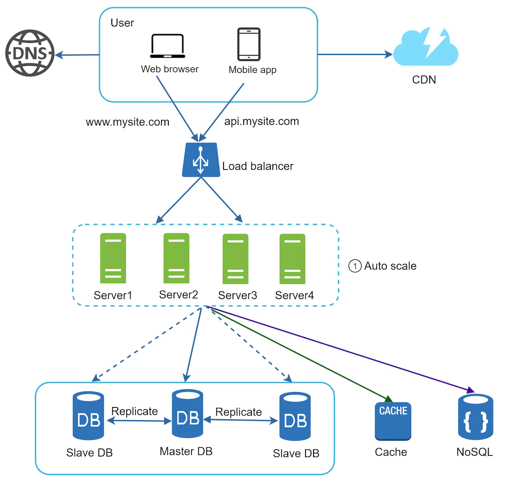

### Stateless web tier

- To scale the web tier horizontally, the state (e.g. user session data) needs to be moved out of the web tier. A good practice is to store them in the persistent storage such as relational db or NoSQL. So each web server in the cluster can access these data. This is called stateless web tier.

#### Stateful architecture

- A stateful server remembers client data (state) from one request to the next. The issue is that every request from the same client must be sent to the same server.
- This can be done with sticky sessions in most load balancers, however this adds the overhead. Adding or removing servers is much more difficult with this approach. Also, challenging to handle server failures.

#### Stateless architecture

- Requests can be sent to any web servers which fetch state data from a shared data store.

Here, we moved the session data out of the web tier and store them in the persistent data store. The shared data store could be a relational db, Memcached/Redis, NoSQL etc. For this example, the NoSQL data store is chosen as it is easy to scale. After the state data is removed out of web servers, auto-scaling of the web tier gets easier.