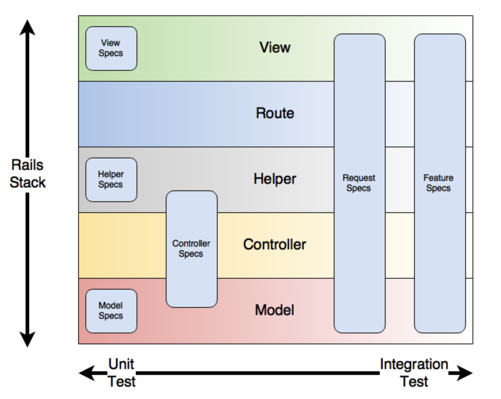

> From [thoughtbot/blog](https://thoughtbot.com/blog/rails-test-types-and-the-testing-pyramid) by Joël Quenneville

### Rails Test Types and the Testing Pyramid

#### Unit Tests

- They implement the expected behavior independent of the surrounding system. Because of this, unit tests are usually small and fast.
- Examples of unit tests are model and view specs.

#### Integration tests

- These tests exercise the system as a whole rather than its individual components.
- Instead of being concerned with invoking methods or calling out to collaborators, integration tests are all about clicking and typing as a user.
- Tend to be much slower and more brittle than their unit counterparts
- Feature and request specs are both integration tests.

#### Hybrid

- Testing several components together but not the full system. (e.g.) Controller specs generally test some aspect of the model and helper layers in addition to the controller itself.

> Found this article from [google blog](https://testing.googleblog.com/2015/04/just-say-no-to-more-end-to-end-tests.html) quite useful.
