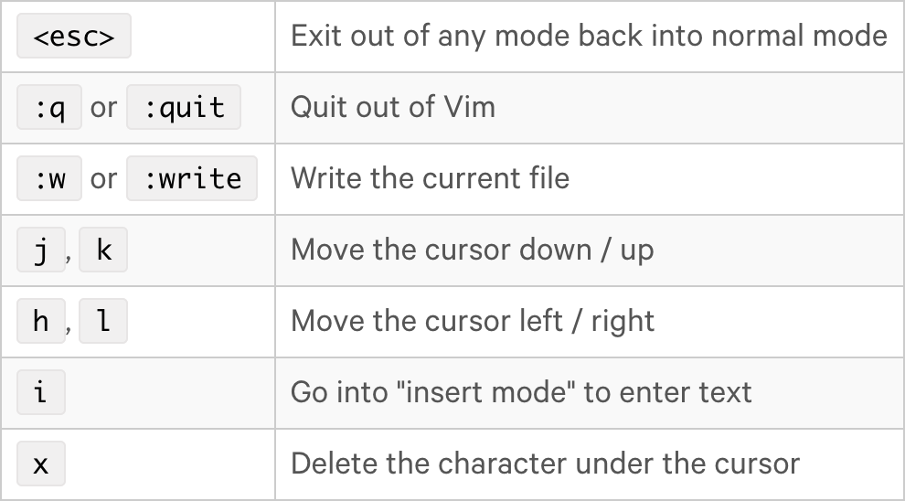
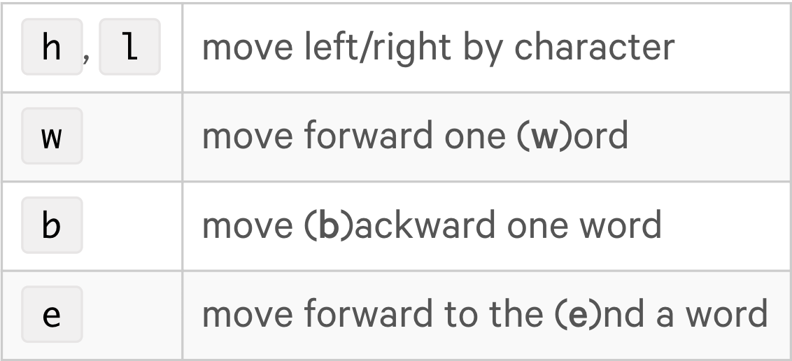
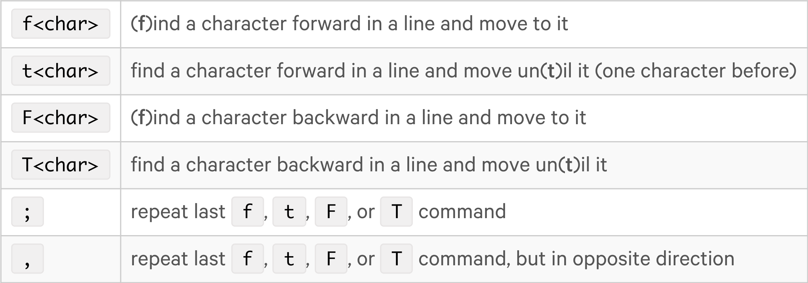
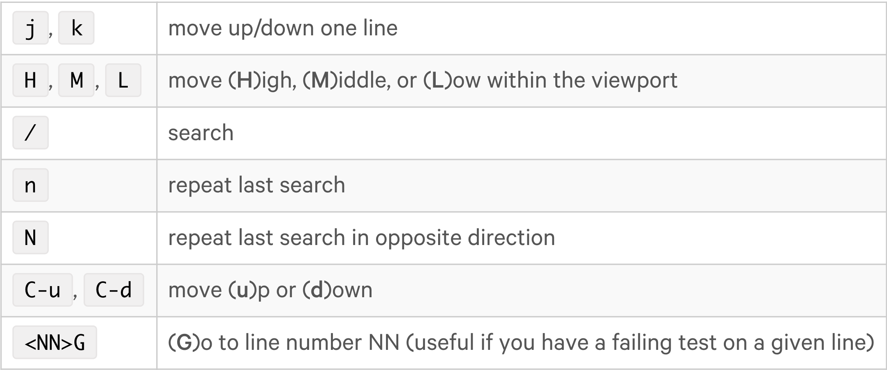

### From [Onramp to Vim](https://thoughtbot.com/upcase/onramp-to-vim) tutorial at [Upcase](https://thoughtbot.com/upcase)

#### Surviving your first week

- Run `$ vimtutor` in your shell to do some practice.
- Please keep in mind vimtutor for more commands.

- Use [vimium plugin for chrome](https://vimium.github.io/)

#### Motions and Moving

Moving within a line

Jumping within a line

Moving Between Lines

### From [Navigating Ruby Files with Vim](https://thoughtbot.com/upcase/navigating-ruby-files-with-vim) tutorial at [Upcase](https://thoughtbot.com/upcase)

#### Moving between methods, modules, and classes

`]m` : jump to the start of next **m**ethod definition

`[m` : to the previous one

`]M` : jump to the end of **m**ethod def

`[M` : to the previous one.

-----
`]]` : to the start of module or class definitions

`[[` : previous

`][` : to the end of module or class

`[]` : previous 

----
`f(` : **f**irst opening paranthesis

`O` : **o**pen a new line

`u` : **u**ndo changes

`gg` : jump to the be**g**innin**g** of the file

> Check `vim-ruby.txt` for configurations.

#### 
